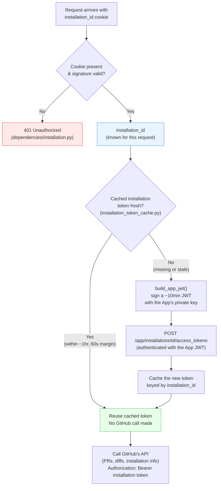
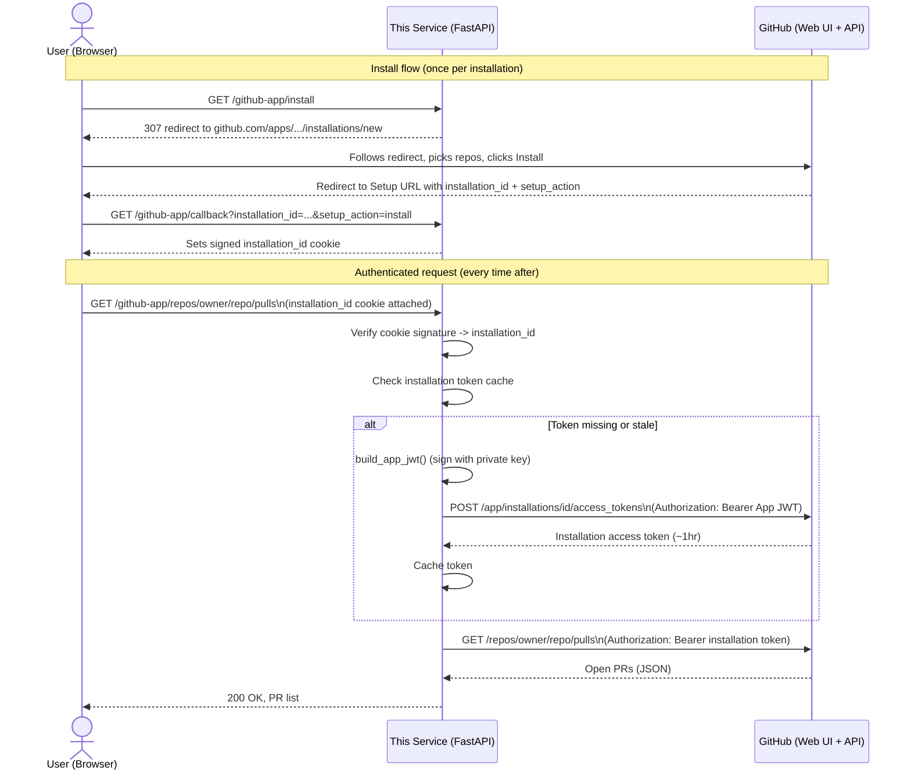

# Week 1 Retrospective — Python Backend Foundations & GitHub App Integration

## What this week actually produced

A running FastAPI service, packaged and containerized, that:

- Authenticates as a GitHub App (its own signed identity, not a logged-in user)
- Lets a user install that App on their account/org via a real browser flow
- Fetches a repo's open PRs and a given PR's diff text, scoped to exactly what that installation was granted
- Retries transient GitHub failures correctly, respecting GitHub's own rate-limit signals
- Runs identically via `uv run` locally or via `docker compose up`

No review logic exists yet — that's Week 2. This week was entirely "can this service reliably get real data out of GitHub, the right way," which is the actual foundation everything else builds on.

## Day-by-day, in one line each

| Day | What shipped |
|---|---|
| 1 | FastAPI scaffolding: routers/services/schemas/dependencies split, fail-fast `Settings`, `pytest` wired up |
| 2 (original) | A full GitHub OAuth App login flow — later replaced, kept as a deliberate before/after commit for comparison |
| 2 (replacement) | GitHub App migration: JWT-signed App identity, installation-scoped access tokens, fine-grained read-only permissions |
| 3 | Fetching open PRs and PR diffs, scoped through the installation auth chain, with GitHub's 404 ambiguity preserved on purpose |
| 4 | Hand-written retry/backoff: `X-RateLimit-Reset`-aware for rate limits, jittered exponential backoff for transient 5xxs, nothing retried that can't succeed |
| 5 | Multi-stage Dockerfile + docker-compose, local-only, real deploy deferred to a concrete future trigger |

## The one real course-correction this week

The OAuth App built on Day 2 was a legitimate, working implementation — and also the wrong long-term shape the moment "other people install this" became a real goal instead of a hypothetical one. Its scopes were either too broad (`repo`, bundled org-management access) or too narrow (`public_repo`, no private-repo access, still read+write). Neither is what a review bot should ask for. The GitHub App replacement isn't a smaller version of the same problem — it's a different identity model entirely (the app authenticates as itself via a private key, not by impersonating a user), and it's the actual fix, not a stopgap. Both versions are preserved as separate commits specifically so the difference is visible, not just described.

---

## Diagram 1 — Installation ID vs. Installation Token: two caches, two different reasons

These two values are both "credentials of a sort" scoped to an installation, and it's easy to conflate them. They're cached completely differently, for reasons that matter:

- **`installation_id`** — signed into a cookie, held by the *browser*, valid for 30 days. It identifies *which* installation a request is scoped to. It's not a secret by itself (knowing the number doesn't let you do anything with GitHub) — it just needs to be tamper-evident, which is why it's signed rather than encrypted.
- **Installation access token** — cached server-side, in-process, valid for roughly 1 hour, refreshed with a 60-second safety margin before real expiry. It's the actual credential used to call GitHub's API — genuinely sensitive, never sent to the browser at all.

**Why they're cached so differently:**

| | `installation_id` | Installation access token |
|---|---|---|
| Where it lives | Signed cookie, in the browser | In-memory dict, server-side only |
| Lifetime | 30 days | ~1 hour (GitHub-imposed) |
| Sensitive if leaked? | Not by itself — just an identifier | Yes — it's a working credential |
| Why cache it there | So the browser doesn't need to re-auth every request | So every request doesn't mint a brand-new token, which GitHub's API would allow but is wasteful and unnecessary |
| What invalidates it | Signature tampering, or 30-day expiry | Natural ~1hr expiry, checked via `_is_fresh()`'s margin |

The short-lived server-side token existing at all is what makes the long-lived client-side id *safe* to keep around for 30 days — even if that cookie were somehow exposed, it only identifies an installation, it can't be used to call GitHub directly. The actual working credential never leaves the server and expires on its own within the hour regardless.

---

## Diagram 2 — Server, User, and GitHub App: who talks to whom, and when

Two distinct kinds of communication happen in this system, and they never cross: the **user's browser** only ever talks to *this server* and *GitHub's web UI* (never GitHub's API directly), and *this server* only ever talks to **GitHub's API** (never the browser's cookies-as-credentials — it reads the cookie, but the actual GitHub calls use server-minted tokens).

**What's deliberately absent from this picture:** the browser never receives an App JWT or an installation access token — both stay server-side for their entire lifetime. GitHub never sees a signed cookie — cookie verification is entirely local to this server. And the private key file itself never crosses any of these arrows at all; it's read once, locally, each time a JWT needs signing.

---

## Learning Notes: Similarities to Prior Work

Private cross-reference only — doesn't affect anything above.

- The overall week rhythm (plan doc up front, day-by-day build-and-record, a course-correction mid-week that gets documented rather than quietly overwritten) matches the earlier TypeScript project's Week 1 almost exactly — the specific technologies changed, the process didn't.
- This is the first week to include a genuine architecture pivot within the week itself (OAuth App → GitHub App), which the earlier project's Week 1 didn't have — worth remembering as a real example of the "the first design wasn't wrong to build, it just revealed the better one" pattern this project has now hit more than once.
- Diagramming the auth/caching model explicitly (this doc's two Mermaid diagrams) is new for this project — the earlier project never had comparable multi-actor, multi-credential complexity to visualize; GitHub App auth's JWT → installation-token → cache chain is the first thing in either project genuinely worth drawing rather than just describing in prose.
