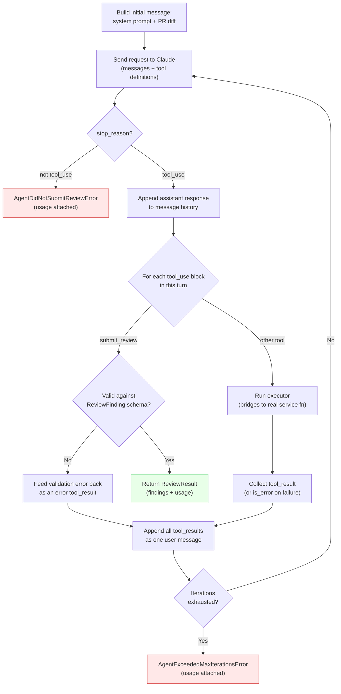

# Week 2 Retrospective — Tool-Use Agent Loop

## What this week actually produced

A working, end-to-end (if not yet perfectly reliable) code review agent: given a real PR, `POST /github-app/repos/{owner}/{repo}/pulls/{number}/review` runs a Claude-driven tool-calling loop that reads files, searches the codebase, checks dependency versions, and lints changed files — deciding for itself which of those to do, in what order, based on what it's already learned — until it produces a structured, typed list of findings, or exhausts a hard iteration budget. Every review reports the real token cost it spent, win or lose.

No review logic existed before this week. By the end of it, this project has its first genuinely LLM-driven control flow — the first place in either this project or the earlier TypeScript project where the actual code path executed isn't fully determined by the input alone.

## Day-by-day, in one line each

| Day | What shipped |
|---|---|
| 1 | Claude API wiring: a DI-provided `AsyncAnthropic` client mirroring the existing `httpx` pattern, the `ReviewFinding`/`FileContent` contracts, and the first tool, `get_file_content` |
| 2 | `search_codebase` (GitHub code search) and `check_dependency_versions` (manifest discovery across Python/npm/NuGet, exact-pin parsing, registry lookups) |
| 3 | `run_linter` across three languages — `ruff`, `oxlint`, and `dotnet format` against a scaffolded throwaway `.csproj` — the week's biggest infrastructure addition, and the first time a plan's exact command choice was found wrong and corrected mid-build |
| 4 | The agent loop itself: five tool definitions, four executors bridging agent-visible arguments to the real service functions, `submit_review` with self-correction on validation errors, a hard iteration cap |
| 5 | Manual end-to-end testing against a real PR, which failed — diagnosed and fixed: cost tracking (including on failure, not just success) and the project's first logging |

## The one real course-correction this week

Day 4's plan explicitly said `get_file_content` would expose `ref` as an agent-supplied argument. Writing the actual tool schemas surfaced why that was wrong: there is exactly one correct ref for an entire review (the PR's head commit), and nothing else in this design gives the model a legitimate second ref to ever supply — exposing it would only invite a hallucinated SHA. Both file-reading tools close over the fixed ref instead, a small but real deviation recorded rather than silently absorbed, consistent with Day 3's `dotnet format` correction the same week.

---

## Diagram — The Agent Loop

The core mechanic, stripped to its essential cycle (see `docs/week-2/week-2-day-4-plan.md` for the full mechanics, including exact Anthropic SDK shapes):

**What this diagram makes visible that prose doesn't as clearly:** both failure exits (`D` and `N`) and the success exit (`I`) all happen *after* real API calls have already been made — which is exactly why Day 5 found that usage needed to be attached to the failure exceptions too, not just the success return. A failure isn't a free "nothing happened" — real, billed work already occurred by the time either error is raised.

---

## Real gaps found only by testing against the real API, not mocks

Two, both worth remembering as a category, not just individually:

1. **`dotnet format analyzers` (Day 3)** didn't catch what plain `dotnet format` does — discovered by actually running the command, not from documentation.
2. **Model pricing lookup by exact string match (Day 5)** would have silently failed in production — Anthropic's real responses echo a dated snapshot suffix (`claude-haiku-4-5-20251001`) no mocked test ever needed to reproduce, since the test fakes only needed to satisfy this project's own assumptions about the shape, not GitHub's or Anthropic's actual behavior.

Both are the same lesson: a mocked test suite proves internal logic is self-consistent, never that it agrees with what a real external system actually does. This project's mocked-by-default testing discipline (deliberate, and correct for iteration speed) has a structural blind spot, and this week hit it twice.

---

## Learning Notes: Similarities to Prior Work

Private cross-reference only — doesn't affect anything above.

- **The overall week rhythm** (plan-then-build for Days 1 and 4, build-then-document for Days 2, 3, and 5 once the exact shape only became clear by doing) matches Week 1's mixed rhythm — this project doesn't force every day through the same plan-first ceremony when the plan itself isn't the valuable part of a given day's work.
- **A hand-rolled implementation before reaching for a framework** (the tool-call loop, built by hand this week, with LangGraph deliberately deferred to Week 3) repeats Week 1's same instinct with `github_retry.py` — understand the raw mechanics first, evaluate a framework's actual value second, once there's something concrete to compare it against.
- **This is the first week with two separate "only a real API call could have caught this" bugs**, both recorded rather than fixed silently — a genuinely new pattern for this project (Week 1 had real bugs too, like the `.gitignore` `.pem` issue, but not this specific "mocked tests can't catch this class of thing" shape, twice, in one week).
- **Diagramming a genuinely non-deterministic control flow** (this week's agent-loop diagram) is a new kind of diagram for this project — Week 1's diagrams (installation-id/token caching, server/user/GitHub comms) were both deterministic sequences; this one has real branches whose path depends on runtime model behavior, which is exactly why Week 2 needed logging in a way Week 1 never did.
