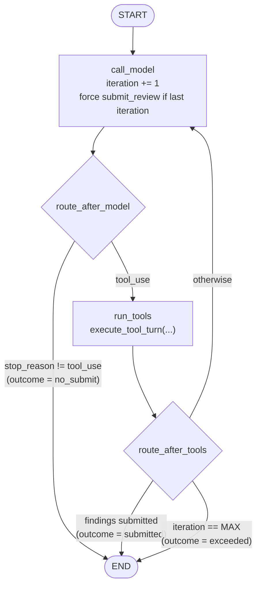

# Day 1 Plan — Close Week 2, Extract Shared Tools, Faithful LangGraph Port

## Why this day matters

Today has one job before anything new is built: make sure there is a **working baseline** to compare against. Week 2's hand-rolled loop has never finished a real review. Everything this week (the port, the workflow, the measurements) is a comparison against that loop, and a comparison against something that doesn't work is meaningless. So the day opens by getting one real, successful, correctly costed review out of the Week 2 engine.

Only then does LangGraph enter, and deliberately in its **most boring possible form**: a line-for-line translation of the Week 2 loop into a graph. Same prompt, same tools, same budget, same outputs, same errors. If the port is faithful, every Week 2 test scenario passes against both engines unchanged. That's the result that makes Day 3's measurements honest, because any later difference between "loop" and "workflow" can then be attributed to *architecture* (specialists, triage, parallelism), not to "LangGraph did something subtly different."

A useful way to hold the day in your head: **Part A** fixes the old thing, **Part B** tidies it so it can be shared, **Part C** learns the new framework's vocabulary, and **Part D** rewrites the old thing in that vocabulary and proves nothing changed.

---

## Part A — Close out Week 2

### A1. One real successful run

- Start the app (`uv run fastapi dev src/main.py`), then `POST /github-app/repos/<owner>/<repo>/pulls/<n>/review` where `<n>` is the PR for `test/small-readme-pr`.
- Record in `docs/week-3/week-3-day-1.md`: iterations used, which tools were called, token counts, estimated cost, and the findings. Record them even if the review has no findings (an empty list via `submit_review` is a *successful* outcome; Week 2 was explicit about that).
- If it still fails on a one-file PR, **stop and diagnose before doing anything else today.** A one-file PR failing would mean something is wrong with the loop, not the model's planning, and porting a broken loop would just produce a broken graph.

### A2. Fix non-convergence: forced final submission

**Like I'm five:** a test with a time limit. When the teacher says "pencils down," you hand in what you have, even if you weren't finished. You don't get to keep writing forever, and you don't hand in a blank page either.

**What's wrong today:** on the last allowed iteration the model can still ask for *another* tool. The loop then has no iterations left, and the review fails with `AgentExceededMaxIterationsError` after all that money was spent, returning nothing.

**The mechanic.** The Messages API takes a `tool_choice` parameter that controls how the model may use tools:
- `{"type": "auto"}` (default): the model decides whether to call a tool and which one.
- `{"type": "any"}`: the model must call *some* tool.
- `{"type": "tool", "name": "submit_review"}`: the model must call *exactly this* tool.
- `{"type": "none"}`: the model may not call tools.

On the final iteration (`iteration == MAX_ITERATIONS`), the request passes `tool_choice={"type": "tool", "name": "submit_review"}`. The model has already seen every tool result gathered so far and now *has* to turn them into findings.

**What still can't be guaranteed:** if that forced `submit_review` input fails Pydantic validation, there's no iteration left for self-correction, so `AgentExceededMaxIterationsError` is still possible. That's accepted and documented rather than solved: it's now a rare "the model produced invalid JSON at the last moment" failure instead of the routine "the model ran out of time" failure.

**Also added:** one sentence in `SYSTEM_PROMPT` saying that when several checks are independent (for example, reading three different files), request them all in the same turn. Week 2's logs showed Haiku never batched. This doesn't *force* batching, but the API has always supported multiple `tool_use` blocks in one turn and the loop already handles them.

**Alternatives considered:**

| Option | Why not (or not alone) |
|---|---|
| Raise `MAX_ITERATIONS` (e.g. 8 → 15) | Treats the symptom. A bigger PR hits the new cap just the same, and every extra iteration re-sends the whole growing history, so cost grows faster than linearly. |
| Tell the model its remaining budget each turn ("3 tool calls left") | Reasonable and cheap, but advisory: the model may ignore it. Worth adding later if Day 3's numbers show late submissions still being poor. Not needed for correctness once the final turn is forced. |
| Reserve the *last two* iterations for forced submission (allows one validation retry) | A real improvement on paper, but costs one iteration of investigation on every review to protect against a failure that hasn't been observed yet. Revisit only if a forced submission ever fails validation in practice. |
| Switch the dev model from Haiku to Sonnet | Changes cost, not the design flaw. Model choice is a Day 3 *measurement* (Haiku vs Sonnet for specialists), not a fix. |

### A3. Tests for Part A

- A fake client that never submits unless forced: assert the final `create` call received `tool_choice={"type": "tool", "name": "submit_review"}`, that earlier calls didn't, and that the scripted forced response ends the loop successfully.
- If `FakeMessages.create` doesn't already record the `kwargs` of each call, extend it to. Several Day 1 tests need to inspect exactly what was sent.

---

## Part B — Extract `review_tools.py`

### What moves

From `src/services/review_agent.py` into a new `src/services/review_tools.py`:
- `SYSTEM_PROMPT`
- `TOOL_DEFINITIONS`
- `SubmitReviewArgs`
- `_dump_list`
- the four `_execute_*` executor functions
- `_TOOL_EXECUTORS`, renamed `TOOL_EXECUTORS` because it's now imported across modules and a leading underscore would be a lie
- **new:** `execute_tool_turn(...)`

### What `execute_tool_turn` is

The body of Week 2's inner `for block in tool_use_blocks:` loop, lifted into one function:

```python
# sketch — exact code written on the day
async def execute_tool_turn(
    tool_use_blocks: list[dict],        # plain dicts: {"type","id","name","input"}
    client: httpx.AsyncClient,
    installation_token: str,
    owner: str,
    repo: str,
    ref: str,
) -> tuple[list[dict], list[ReviewFinding] | None]:
    """Returns (tool_result blocks for the next user message, submitted findings or None)."""
```

It dispatches executors, turns executor exceptions into `is_error` tool results, validates `submit_review` (feeding validation errors back as `is_error`), and always returns exactly one `tool_result` per `tool_use` block, which is the invariant Week 2's comment explains.

### Why extract, and why extracting this much isn't "cheating" the comparison

The comparison this week is about **control flow**: who decides what runs next, how state is carried, how failure and budget are handled. It is *not* about how one tool call gets executed. That per-turn logic is genuinely identical in both engines. If each engine had its own copy, the first bug fix would land in one copy and not the other, and Day 3's numbers would start measuring *drift* instead of *design*. Sharing it keeps the variable under test isolated.

**Alternatives considered:**
- *Import the private names from `review_agent.py` into the graph module:* works, but makes the new engine depend on the old engine's internals, and the old engine is scheduled to be deleted in Week 4 (or kept, depending on Day 3). Shared code should live in a module neither engine owns.
- *Duplicate the code:* rejected for the drift reason above.
- *Make it a class (`ToolExecutor` holding client/token/owner/repo):* a closure-ish object would remove the repeated parameters. Rejected for now because it's a new pattern with no second use yet. If Day 2's specialists end up passing the same five values everywhere, a small frozen dataclass (`ToolContext`) is the natural step, and the graph's `ReviewContext` (Part D) may simply become that.

### Change discipline

This is a **pure move**. The commit that extracts it should change no behavior, and all 61 existing tests must pass with only their import lines changed (`tests/test_review_agent_executors.py` imports the executors). Part A's behavior change goes in a separate commit, so if something breaks, `git bisect` points at one or the other, not a blend.

---

## Part C — LangGraph fundamentals (what you need before writing the port)

`uv add langgraph` (1.2.12 verified current).

### C1. The pieces

**`StateGraph(StateType, context_schema=ContextType)`.** The builder. `StateType` is usually a `TypedDict` describing everything the graph remembers between steps. `context_schema` describes things the graph *uses* but doesn't *remember* (clients, credentials).

**Nodes.** Plain `async def` functions:

```python
async def call_model(state: LoopState, runtime: Runtime[ReviewContext]) -> dict:
    ...
    return {"iteration": state["iteration"] + 1, "messages": [assistant_message]}
```

A node **returns only the keys it wants to change**, not the whole state. Nodes never mutate `state` in place. LangGraph takes the returned partial update and merges it in.

**Reducers.** How a returned value merges into existing state, declared with `Annotated`:
- no annotation → **replace** (`iteration: int` — the new value overwrites the old)
- `Annotated[list[dict], operator.add]` → **append** (returning `{"messages": [m]}` adds `m` to the end)
- `Annotated[int, operator.add]` → **sum** (returning `{"input_tokens": 1200}` adds 1200 to the running total)

**Like I'm five:** each page of the shared notebook has a rule printed at the top. "Cross out and rewrite" is the normal rule. "Only add to the bottom" is for lists. "Add to the number" is for scores.

**Why reducers matter even in today's single-path graph:** they let a node say "here's what *I* contributed" without first reading and copying the whole list. On Day 2 they're essential, because four specialists running at the same time can't safely do read-modify-write on the same list, but they *can* each say "append these."

**Edges.**
- `add_edge("a", "b")`: after `a`, always run `b`.
- `add_edge(START, "a")`: where the graph begins. `END` is where it stops.
- `add_conditional_edges("a", route_fn, ["b", "c", END])`: after `a`, call `route_fn(state)`, which returns the name of the next node. The third argument lists the possible destinations, so LangGraph can validate and draw the graph without running it.

**`compile()`** turns the builder into a runnable graph (a `CompiledStateGraph`), checking things like "does every edge point at a real node." Compile once at startup. The compiled graph holds no per-run data, so one instance serves every request concurrently.

**Running it:**

```python
final_state = await graph.ainvoke(
    initial_state,
    config={"recursion_limit": 40},
    context=ReviewContext(...),
)
```

### C2. Super-steps and the recursion limit (why the name "Pregel")

**Like I'm five:** a game played in rounds. In each round, everyone whose turn it is moves at the same time. Then everyone looks at the board, and the next round starts. There's also a house rule: the game ends after at most 25 rounds, no matter what.

**Really:** LangGraph's runtime is modelled on Google's **Pregel** / bulk-synchronous-parallel design. Execution proceeds in **super-steps**. Each super-step runs every node that's scheduled (one node in a linear graph, several in a fan-out), applies all their updates through the reducers, then decides the next set. The compiled graph's class is literally `Pregel`.

`recursion_limit` (default **25**) caps super-steps per run and raises `GraphRecursionError` when exceeded. It's a framework backstop against infinite cycles, the same idea as `MAX_ITERATIONS` at a different layer. For the port, one Week 2 iteration = two super-steps (`call_model` + `run_tools`), so 8 iterations need about 17. Setting it explicitly to `2 * MAX_ITERATIONS + 5` makes the project's own cap the one that fires, with its own named error and attached usage, while the framework's cap stays as a safety net that should never fire. If `GraphRecursionError` ever *does* fire, that's a bug in the graph's routing, and it should be treated as one.

### C3. Runtime context vs state (and why it's decided today, not on Day 4)

State is saved by the checkpointer; context is not (verified in the throwaway environment before this plan was written). Day 1 has no checkpointer yet, but deciding the split now means Day 4 is "add a checkpointer" rather than "add a checkpointer and discover the installation token is being written to Postgres."

```python
@dataclass(frozen=True)
class ReviewContext:
    http_client: httpx.AsyncClient
    anthropic_client: anthropic.AsyncAnthropic
    settings: Settings
    installation_token: str
    owner: str
    repo: str
    head_sha: str
    pr_number: int
```

A node reads `runtime.context.installation_token`. Nothing in `LoopState` is a secret, a live client, or an SDK object.

### C4. Plain data in state (the verified gotcha)

`response.content` from the Anthropic SDK is a list of Pydantic objects (`TextBlock`, `ToolUseBlock`). Week 2 appended those objects directly to `messages`, which is fine for a local list. Put them in LangGraph state with a checkpointer, though, and deserialization logs *"Deserializing unregistered type anthropic.types.text_block.TextBlock ... This will be blocked in a future version"* (reproduced before this plan was written).

**Decision:** convert at the boundary. `[block.model_dump(exclude_none=True) for block in response.content]` produces `{"type": "text", "text": ...}` and `{"type": "tool_use", "id": ..., "name": ..., "input": {...}}`, which the Messages API accepts directly as request content. `exclude_none=True` matters because SDK blocks carry optional fields (for example `citations`) that serialize as `null`, and it's cleaner not to send them back.

**Test-fake consequence:** Week 2's `FakeToolUseBlock` is a hand-written class. Either give it a `model_dump()` or, better, have the fakes construct the real `anthropic.types.TextBlock` / `ToolUseBlock` types, so the conversion code runs against the same types production sees. The second option is chosen: a fake that mirrors real types catches shape mismatches, while a fake that mirrors the project's assumptions can't (Week 2's retrospective lesson, twice over).

---

## Part D — The faithful port

### D1. State

```python
# src/services/review_graph/state.py — sketch
class LoopState(TypedDict):
    messages: Annotated[list[dict], operator.add]
    iteration: int
    input_tokens: Annotated[int, operator.add]
    output_tokens: Annotated[int, operator.add]
    stop_reason: str | None
    findings: list[dict] | None                     # validated ReviewFinding, dumped
    outcome: Literal["submitted", "no_submit", "exceeded"] | None
```

**Why `MessagesState` / `add_messages` aren't used:** they're LangGraph's built-ins for message lists, but `add_messages` expects **LangChain message objects** (`AIMessage`, `ToolMessage`) and does ID-based merging. This engine sends raw Anthropic-format dicts, so a plain `operator.add` append is both correct and simpler. (Day 3's LangChain specialist *will* use `add_messages`, which is exactly one of the differences worth feeling.)

### D2. Nodes and routing



- **`call_model`**: builds the request from `state["messages"]`, passes `tool_choice` forced on the final iteration (Part A), and returns the assistant message as plain dicts, `iteration + 1`, the token deltas (summed by the reducers), and `stop_reason`. If `stop_reason != "tool_use"`, it also sets `outcome="no_submit"`.
- **`route_after_model`**: `END` if `outcome` is set, else `"run_tools"`.
- **`run_tools`**: pulls the `tool_use` blocks out of the last assistant message and calls the shared `execute_tool_turn`. It returns the tool-result user message plus `findings` / `outcome="submitted"` if a valid `submit_review` came back, or `outcome="exceeded"` if this was the last iteration.
- **`route_after_tools`**: `END` if `outcome` is set, else `"call_model"`.

### D3. Expected outcomes are data; unexpected failures are exceptions

Week 2 raises `AgentDidNotSubmitReviewError` / `AgentExceededMaxIterationsError` from inside the loop. In the graph, those two are **state** (`outcome`), and the graph always ends normally at `END`. A thin runner converts the final state into a `ReviewResult` or raises the *same* two exceptions, with the same attached `ReviewUsage`, so the router needs no changes.

**Like I'm five:** "I finished the maze" and "I reached the exit sign but the door was locked" are both *answers*, and you write them in your notebook. "The building caught fire" is not an answer; that's when you run out shouting.

**Why:**
1. From Day 4, a normally ended graph writes a final checkpoint that *records* the failure. A graph killed by an exception leaves its last checkpoint looking "in progress," and a resume would re-run the failing step, re-paying for it, to reach the same deterministic failure.
2. From Day 2, LangGraph's `retry_policy` and `error_handler` act on exceptions raised in nodes. Business outcomes shouldn't be eligible for framework retries. Only genuinely unexpected failures (a network error that escaped the SDK's retries, a bug) should be.
3. The old loop's exceptions become a presentation detail of the runner, so both engines expose an identical interface to the router.

**Alternative:** raise the exceptions from inside the nodes, as Week 2 does. Simpler today, and it would pass today's tests, but it makes Day 4's checkpoints lie about failed runs.

### D4. The runner and the engine registry

```python
# src/services/review_graph/loop_graph.py — sketch
async def run_review_graph(client, anthropic_client, settings, installation_token,
                           owner, repo, pr_number) -> ReviewResult:
    pr = await fetch_pull_request_metadata(...)
    diff_text = await fetch_pull_request_diff(...)
    final = await LOOP_GRAPH.ainvoke(
        {"messages": [initial_user_message(pr, diff_text)], "iteration": 0,
         "input_tokens": 0, "output_tokens": 0, "stop_reason": None,
         "findings": None, "outcome": None},
        config={"recursion_limit": 2 * MAX_ITERATIONS + 5},
        context=ReviewContext(...),
    )
    return to_review_result_or_raise(final, settings)
```

- The same signature as `run_review_agent`, deliberately. That's what makes the next bullet a dict.
- `src/services/review_engines.py`: `ENGINES: dict[Engine, EngineFn] = {"loop": run_review_agent, "graph": run_review_graph}`.
- `src/schemas/review.py`: `Engine = Literal["loop", "graph"]`, extended on Days 2 and 3.
- `src/routers/review.py`: `engine: Engine = Query("loop")`. An unknown engine gets FastAPI's automatic `422`, with no hand-written validation.
- PR metadata and diff are fetched by the **runner**, not a node, to mirror Week 2 exactly. Day 2's workflow moves this into a `fetch_context` node, where it gets checkpointed.

**Why `Query` and not a setting:** the comparison harness (Day 3) needs to choose the engine *per request* against the same running server. A `REVIEW_ENGINE` env var would mean restarting between runs. A settings-level *default* can come later, once there's a winner.

### D5. Structural decisions and alternatives for the port

| Decision | Alternative | Why this one |
|---|---|---|
| Graph API (`StateGraph`, explicit nodes/edges) | **Functional API** (`@entrypoint` / `@task` in `langgraph.func`, verified present): write the loop as ordinary `async` code, with each `@task` checkpointed | The Functional API would port the loop almost verbatim and still get checkpointing, and for a loop-shaped agent it's honestly a strong real-world choice. But it has no explicit graph to draw or route, which is precisely what this week compares. Worth one paragraph in the Day 3 comparison doc as "the option I'd seriously consider in production for a pure loop." |
| Conditional edges for routing | Nodes return `Command(goto=..., update=...)` ("edgeless" routing) | With conditional edges, nodes only compute and the routing lives in small, separately testable functions, all declared in one place (`build_loop_graph()`), which is also what `get_graph().draw_mermaid()` draws. `Command` spreads routing across node bodies. It's useful when the routing decision needs data only the node has, which isn't the case here. |
| `TypedDict` state | Pydantic `BaseModel` state (supported) | Pydantic state re-validates on every update and has serialization quirks through checkpoints. Validation already happens at the *boundaries* that matter (`SubmitReviewArgs`, tool inputs), same as the rest of this project. State is internal. |
| Prebuilt agent (`create_react_agent`, deprecated; `langchain.agents.create_agent`) | — | It hides the entire loop behind one call and requires LangChain message types. Using it would make the "raw vs LangGraph" comparison "raw vs a black box." |
| One graph compiled at import time (`LOOP_GRAPH`) | Compile per request | Compiling validates and builds the graph structure, and the result is stateless and reusable. Per-request compilation is wasted work. Day 4 moves compilation into app startup because the checkpointer (a pool-backed object) only exists then. |

---

## Files

1. `src/services/review_tools.py` — NEW (Part B)
2. `src/services/review_agent.py` — imports from `review_tools`; forced final `tool_choice`; batching sentence in the prompt (Part A)
3. `src/services/review_graph/__init__.py`, `state.py`, `loop_graph.py` — NEW (Part D)
4. `src/services/review_engines.py` — NEW
5. `src/schemas/review.py` — `Engine`
6. `src/routers/review.py` — `engine` query param, dispatch through `ENGINES`
7. `pyproject.toml` / `uv.lock` — `langgraph`
8. Tests: `tests/test_review_agent.py` parametrized over engines (moved into a shared fixture); `tests/test_loop_graph.py` (graph-specific: structure, recursion limit, state never holds SDK objects); `tests/test_review_router.py` (engine param, `422` on an unknown engine)

Comment density follows the Week 2 memory note: every new function gets a verbose *why* comment, especially the "outcome as data" choice, the context/state split, and the recursion-limit arithmetic.

---

## .NET parallels

- `StateGraph` with nodes and conditional edges ≈ the **Stateless** library's `StateMachine<TState, TTrigger>` configuration (`.Configure(...).Permit(...)`, `PermitIf(...)`), except here the "state" is a data bag, not an enum, and transitions are computed by functions.
- Reducers ≈ Redux-style reducers, and conceptually close to how Durable Functions merges activity results into orchestrator locals. `operator.add` on a list is `AddRange`.
- "Outcome as data, exceptions for the unexpected" ≈ the `Result<T>` / `OneOf` pattern vs throwing, the same argument .NET teams have about domain failures vs exceptions.
- `recursion_limit` ≈ Durable Functions' guard against unbounded `ContinueAsNew` loops: a framework-level cap sitting under your own business-level cap.
- `Runtime[ReviewContext]` ≈ constructor-injected services in an `IHostedService` that are deliberately *not* part of the persisted orchestration state.

---

## Automated verification (no real API calls)

- **Parity:** every scenario in `tests/test_review_agent.py` (single tool then submit, multiple sequential tools, self-correction after invalid submit, max-iterations, stop without tool use, failing executor → `is_error`) runs against both `loop` and `graph` via a parametrized fixture. Both must produce the same `ReviewResult` (or the same exception type with the same usage) *and* send the same `messages` to the fake client on every call. Assert the latter by normalizing both to plain dicts.
- **Forced final:** the new Part A test runs against both engines too.
- **Graph-specific:** the compiled graph's node set is exactly `{call_model, run_tools}` plus START/END. A run with an always-tool-calling fake ends with `AgentExceededMaxIterationsError`, **not** `GraphRecursionError`. After a run, every value in `state["messages"]` is JSON-serializable (`json.dumps` doesn't raise), which guards the Day 4 gotcha.
- **Router:** `?engine=graph` dispatches to the graph runner (patch `ENGINES`); `?engine=bogus` → `422`.
- `uv run pytest` and `uv run ruff check .` clean.

## Manual verification

```bash
uv run fastapi dev src/main.py

# Baseline (Part A) — the Week 2 engine, finally succeeding
curl -X POST -b cookies.txt \
  "http://localhost:8000/github-app/repos/<owner>/<repo>/pulls/<small-pr>/review?engine=loop"

# The port against the same PR
curl -X POST -b cookies.txt \
  "http://localhost:8000/github-app/repos/<owner>/<repo>/pulls/<small-pr>/review?engine=graph"

# Compare: both succeed; iteration counts and tool sequences are similar
# (not identical — the model is nondeterministic); costs are the same
# order of magnitude. Record both in week-3-day-1.md.

# Print the port's diagram into the day's retro doc:
uv run python -c "from src.services.review_graph.loop_graph import LOOP_GRAPH; print(LOOP_GRAPH.get_graph().draw_mermaid())"
```

---

## End-of-day checklist

- [ ] A real, successful Week 2-engine review on `test/small-readme-pr`, with usage recorded
- [ ] Forced final `submit_review` implemented and tested
- [ ] `review_tools.py` extracted in its own behavior-neutral commit; all pre-existing tests green
- [ ] `loop_graph.py` built; graph state holds only JSON-plain data; credentials only in runtime context
- [ ] Every Week 2 scenario passes against both engines
- [ ] `?engine=graph` works against the same real PR
- [ ] `uv run pytest` and `uv run ruff check .` both pass
- [ ] `docs/week-3/week-3-day-1.md` written, with an "Alternatives, Patterns, and Architecture Decisions" section

---

## Learning Notes: Similarities to Prior Work

Private cross-reference only — doesn't affect anything above.

- **A behavior-neutral refactor committed separately from a behavior change** is the same hygiene as Week 1's OAuth → GitHub App migration being its own coherent step. It makes `git bisect` and review meaningful.
- **"Outcome as data"** is the same move as Week 2 Day 5 attaching `usage` to exceptions: making failures carry information instead of being bare signals. This goes one step further by not making them exceptions at all *inside* the engine.
- **Fakes built from the real SDK types** directly applies Week 2's retrospective finding: a fake that only satisfies your own assumptions can't catch the places where those assumptions are wrong.
- **Parity tests across two implementations** are new to this project. The closest earlier analogue is Week 2's three linters behind one `LintFinding` contract, which was also "different implementation, same contract, same tests."
