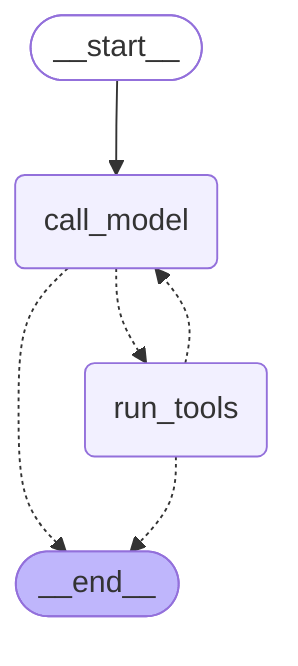

# Day 1 — Week 2 Closed, Shared Tools Extracted, Faithful LangGraph Port

Plan: `docs/week-3/week-3-day-1-plan.md`. Built in the plan's order, with each part committed separately so `git bisect` can tell them apart:

| Commit | Part | Behavior change? |
|---|---|---|
| `c8256f8` | B: extract `review_tools.py` | None (pure move; 61/61 existing tests unchanged apart from import lines) |
| `26bfd3f` | A2: force `submit_review` on the final iteration, plus a batching instruction | Yes (loop only, the only engine at that point) |
| `908e0bd` | C+D: LangGraph port, engine registry, `?engine=`, parity tests | Additive (new engine; `loop` stays the default) |

Branch: `langgraph-rebuild`, created from `raw-agent-loop`. The plan said to merge `raw-agent-loop` into `main` first and branch from there. That merge is still pending as a PR, so this branch builds on top of it. It isn't merged into `main` yet.

---

## What happened

### Week 2 finally closed: a real successful review

Before any code changed, the unmodified Week 2 loop was run against PR #2 (`test/small-readme-pr`, a one-file README change) with `claude-haiku-4-5`:

| Run | Engine | PR | Outcome | Iterations | Input tok | Output tok | Est. cost | Time |
|---|---|---|---|---|---|---|---|---|
| Baseline (before any change) | loop | #2 | ✅ 0 findings | 5 | 16,083 | 820 | $0.0202 | 17.1 s |
| After the port | graph | #2 | ✅ 0 findings | 2 | 2,847 | 407 | $0.0049 | 8.3 s |
| After the port | loop (with forced-final) | #2 | ✅ 0 findings | 3 | 4,542 | 350 | $0.0063 | 7.3 s |
| After the port | loop (with forced-final) | #1 (large) | ✅ 3 findings | 3 | 342,305 | 1,804 | $0.3513 | 27.7 s |

Day 1's real-API spend in total: **$0.38**.

That's the first successful end-to-end review this project has ever produced, which closes Week 2's last open checklist item. Zero findings on a README edit is the correct outcome, and it came back through `submit_review` with an empty list as designed, not as a silent failure.

**Don't read too much into the three PR #2 numbers.** Each is a single sample of a nondeterministic process. The baseline took 5 iterations and the later runs took 2–3, but that could be the new batching instruction, the model's randomness, or both. One run each can't separate those. That's exactly why Day 3's harness runs every combination twice and reports both runs.

### Haiku *did* batch tool calls this time

Week 2's diagnosis said Haiku "never chose to batch": one tool call per turn, on the large PR. On the baseline small-PR run, before the batching instruction even existed, it batched twice (two `search_codebase` calls in iteration 2, two `get_file_content` calls in iteration 3). So the Week 2 observation was true of *that run on that PR*, not a fixed property of the model. Worth correcting in memory: batching behavior varies by run and by task, and a single large-PR run wasn't enough to generalize from.

### The large PR now completes, but forced-final wasn't what got it there

PR #1 (the PR that hit `AgentExceededMaxIterationsError` in Week 2) now returns a review. But the log shows the model **chose** to submit at iteration 3 of 8. It never reached the forced final turn. So:

- The forced-final mechanism is **verified by tests** (the final request carries `tool_choice={"type": "tool", "name": "submit_review"}`, earlier ones `auto`, for both engines), but it **hasn't yet been exercised by a real API run**. That's an honest gap, not a claim. It'll get exercised naturally when Day 2's specialists run against tight per-specialist budgets.
- **The cost is the real story:** 342k input tokens over 3 calls is about 114k tokens *per call*. `raw-agent-loop` now carries all of Week 2's and Week 3's docs, so PR #1's diff is enormous, and the whole diff is re-sent on every iteration. At Haiku prices that's $0.35. At Sonnet 5 prices ($3/MTok input) the same review would be about $1.05. This is concrete, measured evidence for Day 2's triage (skip/trim before the model sees anything) and per-specialist context.
- **Finding quality is poor, for the same reason:** the top finding ("no verified end-to-end execution…") is the model reading *old Week 2 docs inside the diff* and reporting their content as a defect. A docs-heavy diff pulled the review toward docs. Day 2's triage routes Markdown away from the code specialists, which should fix the cause rather than the symptom.

### A made-up tool argument, silently ignored

In the large-PR run, Haiku called `get_file_content({'path': 'src/routers/github_app.py', 'lines': [72, 88]})`. There is no `lines` parameter in that tool's schema. The executor reads `arguments["path"]` and ignores everything else, so the call succeeded and returned the *whole* file, and the model wasn't told its argument had no effect.

Not fixed today (scope), but recorded with its options:
1. `"additionalProperties": false` in each tool's `input_schema`. This tells the model unknown keys are invalid, but it's advisory unless enforced.
2. Anthropic's **strict tool use** (`"strict": true` on a tool definition) makes the API itself guarantee the input matches the schema. Check the current docs for which models support it and any schema restrictions before adopting.
3. Validate tool inputs on the executor side (a Pydantic model per tool) and return an `is_error` result naming the unknown argument, the same self-correction pattern `submit_review` already uses.

Option 3 is the most consistent with this project's "typed boundaries" habit. It belongs with Day 2's per-specialist tool subsets, which already add an `allowed_tools` check in the same function.

---

## What was built

- **`src/services/review_tools.py`**: everything both engines share. The system prompt, the five tool schemas, the four executors and `TOOL_EXECUTORS`, plus `MAX_ITERATIONS` and the two agent exceptions. Also two new pieces:
  - `execute_tool_turn(...)`: the body of Week 2's inner per-block loop, lifted out unchanged.
  - `tool_choice_for(iteration, max_iterations)`: forced `submit_review` on the last iteration, `auto` before that.
- **`src/services/review_agent.py`**: the Week 2 loop, now importing the shared pieces and calling `execute_tool_turn`. Its behavior is unchanged apart from the forced final turn and the new prompt sentence.
- **`src/services/review_graph/state.py`**: `ReviewContext` (clients, credentials, and the fixed facts of a review, passed as runtime context and never checkpointed) and `LoopState` (the graph's memory, plain JSON data only).
- **`src/services/review_graph/loop_graph.py`**: the port. Two nodes (`call_model`, `run_tools`), two routing functions, `RECURSION_LIMIT = 2 * MAX_ITERATIONS + 5`, and `run_review_graph` with the same signature as `run_review_agent`.
- **`src/services/review_engines.py`**: `ENGINES = {"loop": ..., "graph": ...}`.
- **`src/routers/review.py`**: `?engine=loop|graph` (default `loop`), dispatching through `ENGINES`.
- **Tests:**
  - 62 → 75 tests. Every Week 2 agent scenario is now parametrized over both engines.
  - A new parity test asserts both engines send *byte-for-byte equivalent* Messages API requests across a 3-turn script. I confirmed it isn't vacuous by temporarily changing the graph's `max_tokens`: it failed, then passed again after reverting.
  - Graph-specific tests check the node set, the recursion-limit headroom, and that state is JSON-serializable with no token in it.
  - Router tests check engine dispatch and the `422` on unknown engines.

The port's graph, as LangGraph itself draws it (`LOOP_GRAPH.get_graph().draw_mermaid()`):

Dashed arrows are conditional edges, decided at runtime by `route_after_model` / `route_after_tools`. The solid arrow is the one unconditional edge. That's the Week 2 `for` loop's entire control flow, now visible as a picture rather than implied by indentation.

---

## Deviations from the plan (recorded, not silently absorbed)

1. **`execute_tool_turn` takes a list of `ToolCall` dataclasses and returns a `ToolTurnResult` dataclass**, not raw dicts and a tuple as the plan sketched. Each engine holds tool calls in a different representation (SDK objects in the loop, dicts in the graph), and a neutral dataclass lets each engine convert at its own call site, so the shared function depends on neither. The named result fields also read better than `result[0]` / `result[1]`.
2. **`MAX_ITERATIONS` and both exceptions moved into `review_tools.py`.** The plan said the graph would raise "the same two exceptions" but didn't say where they'd live. Leaving them in `review_agent.py` would have made the new engine import from the old engine's module, the exact coupling Part B argued against. They're part of the contract every engine shares, so they live with the rest of it.
3. **`tests/test_review_agent.py` kept its name** even though it now tests every engine. That kept the diff readable; its header comment explains the parametrization. It's a candidate for renaming to `test_review_engines.py` when Day 2 adds the third engine.
4. **The fake now `deepcopy`s each request's kwargs.** This wasn't planned, but it was needed: the Week 2 loop mutates one `messages` list in place, so the fake was recording the *final* conversation for every call. Existing tests happened to pass anyway, but per-call parity comparisons would have been meaningless without the snapshot.

---

## Alternatives, Patterns, and Architecture Decisions

**Decision: the comparison variable is isolated by sharing everything that isn't control flow.** Prompt, tool schemas, executors, per-turn tool execution, iteration budget, and exceptions all come from one module. The engines differ *only* in how they sequence those pieces and carry state. The parity test makes that claim checkable rather than aspirational. *Alternative:* let each engine own its copy. Rejected, because the first bug fix would land in one copy, and Day 3's measurements would then compare drift instead of design.

**Decision: credentials and clients in runtime `context`, never in graph state.** State is exactly what Day 4's checkpointer writes to Postgres. Deciding this now, before any checkpointer exists, means Day 4 adds persistence without auditing what's in state for secrets. The graph test asserts the installation token never appears in serialized final state. *Alternative:* everything in state, which is simpler today and a credential-at-rest problem on Day 4.

**Decision: plain JSON data in state; SDK objects converted at the node boundary.** `block.model_dump(exclude_none=True)` turns the SDK's blocks into dicts before they enter state. The real-API run confirmed the API accepts these dicts back on the next turn, the one thing no fake could prove. *Alternative:* keep SDK objects in state. That works today, but it logs a "will be blocked in a future version" warning once checkpointed (reproduced while planning).

**Decision: expected outcomes (`submitted` / `no_submit` / `exceeded`) are state, and become exceptions only in the runner.** The graph always ends normally at `END`. From Day 4, a normally ended graph's final checkpoint *records* the failure instead of looking mid-run, so a resume can't re-pay for a step that will fail the same way again. It also keeps business outcomes away from LangGraph's retry/error-handler machinery, which acts on exceptions raised in nodes. Unexpected failures (e.g. an Anthropic outage after SDK retries) still propagate as exceptions. *Alternative:* raise from inside nodes as Week 2 does. Simpler, and it would pass today's tests, but it would make Day 4's checkpoints lie about how failed runs ended.

**Decision: conditional edges, not `Command(goto=...)`.** Routing lives in two small pure functions and is declared in one place (`build_loop_graph`), which is also what gets drawn. *Alternative:* nodes return `Command` objects. That's useful when a routing decision needs data only the node has, which isn't the case here.

**Decision: an explicit `RECURSION_LIMIT` with headroom.** LangGraph's default cap (25 super-steps) happens to exceed what 8 iterations need (about 16), so the default would work today. But that's an accident, and raising `MAX_ITERATIONS` to 13 would quietly hand the cap to the framework, replacing the named exception with `GraphRecursionError` and losing the attached usage. Deriving the limit from `MAX_ITERATIONS` keeps the project's own cap in charge, and a test locks that in.

**Decision: the engine registry is a dict of same-signature functions.** Adding an engine is one line plus one `Literal` value. The router can't tell engines apart, and Day 3's harness gets a single seam to iterate over. Router tests now patch the *dict entry* (`monkeypatch.setitem(ENGINES, ...)`) rather than a module attribute. That's still "patch where it's looked up", just applied to a registry.

**Alternatives not taken for the port itself** (from the plan, still standing): LangGraph's Functional API (`@entrypoint`/`@task`) would have ported the loop almost verbatim, with checkpointing included. It's a strong choice for a pure loop in production, but it has no explicit graph to compare against. Prebuilt agents (`create_react_agent`, deprecated) hide the loop entirely. Pydantic state re-validates every update for no benefit over boundary validation.

---

## Python-specific things worth calling out

- **`Annotated[int, operator.add]` as a reducer**: Python's `typing.Annotated` attaches metadata to a type without changing it. LangGraph reads that metadata at graph-build time to decide how to merge updates. `operator.add` is just the `+` operator as a function, so it means "concatenate" for lists and "sum" for ints. The same annotation does both jobs, depending on the type.
- **`match final_state["outcome"]: case "submitted": ...`**: structural pattern matching (Python 3.10+) for the three-way outcome. The `case _:` default is deliberately the "exceeded" branch, so an unexpected `None` outcome would surface as a loud failure rather than a false success.
- **`@dataclass(frozen=True)` for `ReviewContext` and `ToolCall`**: frozen dataclasses raise on attribute assignment, so "these are fixed facts of one review" is enforced by the runtime, not just by convention.
- **`copy.deepcopy(kwargs)` in the fake**: Python passes object references, and the loop's `messages.append(...)` after a call mutates the very list the fake had recorded. That's the same aliasing behavior as a mutable `List<T>` in C#. A snapshot was the only way to see what was actually sent at each call.

## .NET parallels

- The engine registry ≈ a `Dictionary<EngineName, Func<..., Task<ReviewResult>>>` resolved per request, or keyed DI services (`[FromKeyedServices("graph")]` in .NET 8+).
- Outcome-as-state, exceptions only at the edge ≈ returning a `Result<T>` from the domain layer and translating to exceptions/`ProblemDetails` only in the API layer.
- Runtime context vs persisted state ≈ Durable Functions orchestrators: injected services are available to activities, but only the orchestration's inputs and outputs go into the history table. Putting a secret into an orchestration input persists it, the exact mistake `ReviewContext` exists to avoid.
- The parity test ≈ the same xUnit `[Theory]` running against two implementations of one interface via `[MemberData]`, plus an approval test (Verify/ApprovalTests) on the outgoing requests.

---

## Verified manually

- Baseline (pre-change) loop run on PR #2: success, 5 iterations, $0.0202.
- `?engine=graph` on PR #2: success, 2 iterations, $0.0049. **The graph's dict-converted assistant blocks were accepted by the real Messages API**, the key claim fakes can't verify.
- `?engine=loop` (with forced-final) on PR #2: success, 3 iterations, $0.0063.
- `?engine=loop` on PR #1 (large): success, 3 findings, $0.3513, 114k input tokens per call. Forced-final not reached (the model submitted at iteration 3 of 8).
- 🔍 `?engine=bogus` → `422`, with `"Input should be 'loop' or 'graph'"`.
- 🔍 `?engine=` (empty) → `422`, same message. FastAPI doesn't treat an empty value as "use the default".
- `uv run pytest` (75 passed), `uv run ruff check .`, and `uv run ruff format --check src tests` all clean.
- **Not done:** `?engine=graph` on the large PR #1. The parity test already shows both engines send identical requests for the same model responses, and a second $0.35 run would only re-measure the model's randomness. Day 3's harness covers it properly (twice, with a cost guard).

## Noticed along the way (not fixed, worth knowing)

- **`Settings` reads `.env` even in tests.** `conftest.py` sets the required variables, but `ANTHROPIC_MODEL` isn't one of them, so the test suite picks up `claude-haiku-4-5` from the local `.env`. That's harmless today (the fakes ignore the model). It would matter if a test ever asserted on a specific model ID or price. A one-line `monkeypatch.setenv("ANTHROPIC_MODEL", ...)` in `conftest.py` would make tests independent of whoever's `.env`.
- **`ruff format --check .` flags 5 Markdown files.** The installed ruff also formats Python code blocks *inside* `.md` files (it flagged the sketch in this week's own plan). That was pre-existing (the same count before and after today's changes) and is cosmetic. Either run the check on `src tests` only (as today) or let it reformat the docs once.

---

## Learning Notes: Similarities to Prior Work

Private cross-reference only — doesn't affect anything above.

- **"Only a real run can catch this," a third time:** Week 2 found two real-API-only gaps (the `dotnet format analyzers` behavior and the model snapshot suffix). Today found two more: the model inventing a `lines` argument, and docs inside a diff being reviewed as if they were defects. Fakes test *our* logic, and only real runs test *the model's* behavior. Day 3's seeded-bug PR is the structured answer to that.
- **A behavior-neutral commit before a behavior-changing one** paid off immediately: when the parity test ran, there was no question whether the extraction itself had changed anything, because commit `c8256f8` had already proven it against the untouched test suite.
- **Correcting a previous generalization** (Haiku "never batches") is new for this project's docs. Week 2's retro drew a conclusion from one large-PR run, and today's small-PR run contradicted it. Single runs aren't characterizations of a model, which is the same lesson as "two runs per combination" in Day 3's plan.
- **The cost observation (114k tokens/call) turns Day 2's triage from "the plan says so" into "the data says so"**, the same "build it when the need is real" sequence as Week 2's logging, which was added only after a failure was undiagnosable without it.
