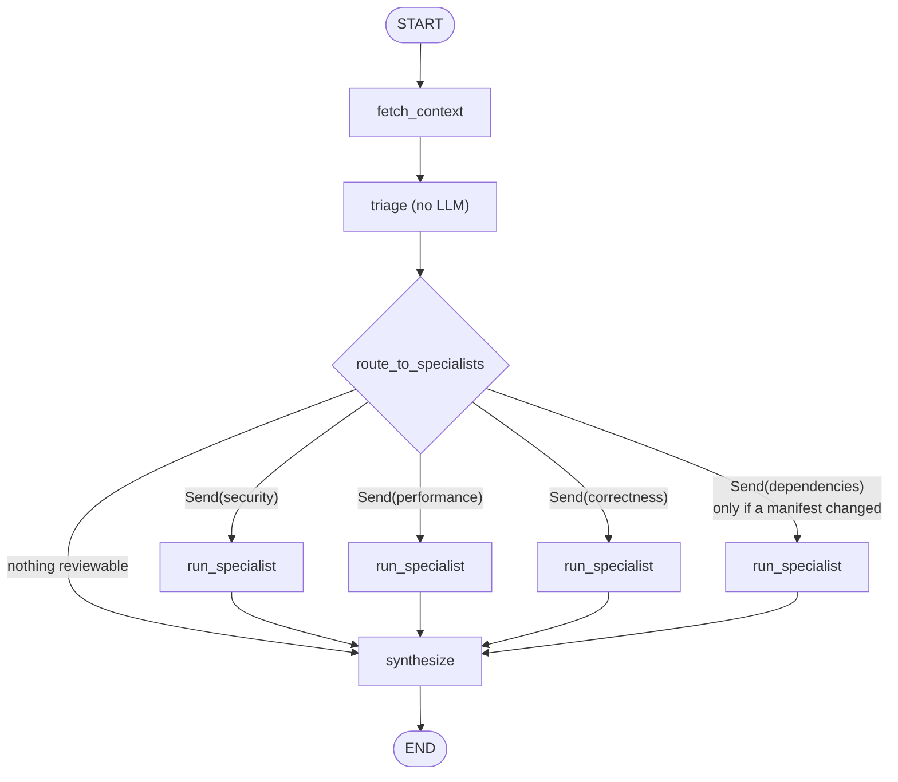

# Day 2 Plan — From a Loop to a Workflow: Triage, Parallel Specialists, Synthesis

## Why this day matters

Day 1 proved LangGraph can express the Week 2 loop *exactly*. On its own, that's a proof of equivalence, not a reason to use a framework: a `for` loop and a two-node cyclic graph are the same program. Today is where the graph starts doing things the loop does badly.

The Week 2 failure diagnosis named the real problem: **one agent, one ever-growing conversation, reviewing everything at once.** Every file read, every search result, and every lint report stays in the message history and gets re-sent on every later call. The model has to juggle security, performance, correctness, and dependencies simultaneously, and it spends its budget one tool call per turn. Adding iterations makes that slower and more expensive, not better.

Today's graph replaces that with how a human review team actually works:

1. **Someone sorts the mail first** (triage): which files changed, which ones are worth looking at, what language they're in, which are lockfiles or generated code nobody should read.
2. **Specialists work in parallel, each with a narrow brief** (security, performance, correctness, dependencies), each seeing only the files relevant to them, with their own small budget and their own notes.
3. **One person merges the reports** (synthesis): removes duplicates, ranks by severity, produces one review.

**Like I'm five:** a hospital. You don't have one doctor who does everything. A nurse at the front desk checks why you're here (triage), then a heart doctor, a bone doctor, and an eye doctor each look at *their* part at the same time, and the main doctor puts all their notes into one report for you.

This is the graph the learning plan describes ("nodes for fetch diff, analyze security, analyze performance, synthesize review, with conditional edges based on file types"), and the one that exercises LangGraph's genuinely distinctive features: fan-out with `Send`, reducers merging parallel results, subgraphs, and per-node timeouts.

---

## Background: the new LangGraph concepts today

### `Send` — fan-out (map)

A conditional edge normally returns one node name. It can also return a **list of `Send` objects**:

```python
def route_to_specialists(state: WorkflowState) -> list[Send] | str:
    if not reviewable_files(state):
        return "synthesize"                       # skip the LLM entirely
    return [
        Send("run_specialist", {"specialist": "security", "files": code_files, ...}),
        Send("run_specialist", {"specialist": "performance", "files": code_files, ...}),
        ...
    ]
```

Each `Send(node, payload)` schedules **one execution of `node` with `payload` as its input**, *not* the shared state. All of them run in the **same super-step**, concurrently. The same node name can appear several times with different payloads, which is how one `run_specialist` node becomes four parallel specialists.

**Like I'm five:** the teacher photocopies one worksheet four times, writes a different kid's name and a different question on each copy, and hands them out at the same moment.

Verified before this plan: two `Send`s to the same node ran concurrently, and their returned `findings` (an `operator.add` list) and `tokens` (an `operator.add` int) merged correctly into the parent state.

### Reducers under concurrency (reduce)

After a super-step with four parallel specialists, LangGraph has four partial updates to apply. With reducers, `specialist_results: Annotated[list[dict], operator.add]` becomes the concatenation of all four, and `input_tokens: Annotated[int, operator.add]` becomes the sum. Without a reducer on a key that two parallel nodes both write, LangGraph raises an `InvalidUpdateError` rather than silently letting the last one win. That's a good failure mode: a race condition becomes a loud error.

**This is the map-reduce pattern:** `Send` is the map, reducers are the reduce, and `synthesize` is the final combine step.

### Subgraphs

**Like I'm five:** the bone doctor has their own little office with their own notepad. They scribble lots of notes while examining you, but only their final one-page report goes back to the main doctor.

Each specialist *is* Day 1's loop graph, parametrized (see "Specialists" below), compiled once per specialist config. There are two ways to use a compiled graph inside another:

| Option | How | Tradeoff |
|---|---|---|
| **Add the compiled subgraph directly as a node** | `parent.add_node("security", security_graph)` | Parent and subgraph must share state keys; overlapping keys flow both ways. Specialist message histories would leak into parent state unless keys are carefully disjoint. |
| **Invoke the subgraph from inside a wrapper node** ✅ | `async def run_specialist(input, runtime): out = await graph.ainvoke(...); return {...mapped...}` | Explicit input/output mapping. The subgraph's `messages` never touch the parent's state. One wrapper serves all specialists, choosing the graph by name. |

**Chosen: wrapper node.** The whole point of specialists is *context isolation*: the parent state should hold findings and token counts, never four transcripts. An explicit wrapper makes that boundary a line of code you can read, rather than a side effect of key naming.

**To verify on the day** (it matters for Day 4): when a subgraph is invoked inside a node, LangGraph propagates the parent's config (and checkpointer) to it, so its steps are checkpointed under a child namespace. Check this with `InMemorySaver` + `aget_state(config, subgraphs=True)`. If propagation works, resume on Day 4 can be *inside* a half-finished specialist. If it doesn't, resume granularity is "whole specialist," which is still correct, just coarser.

### Node timeouts: a catchable one and a backstop

`add_node(..., timeout=...)` (verified: raises `NodeTimeoutError`, async nodes only) enforces a wall-clock cap *around* a node. That error is raised by the framework **outside** the node function, so the node itself can't catch it and turn it into a graceful "this specialist timed out" result. It fails the whole run.

**Decision: two layers.**
- **Inside** `run_specialist`: `async with asyncio.timeout(SPECIALIST_TIMEOUT_S):` around the subgraph call. A timeout there is catchable and becomes a failed-specialist result (see "Failure isolation").
- **On** the node: `timeout=SPECIALIST_TIMEOUT_S + 30` as a backstop. It should never fire, and if it does, that's a bug (for example, a blocking call that ignored cancellation).

**Alternative to evaluate on the day:** `add_node(..., error_handler=...)` exists in 1.2.12, but its semantics (what it receives, what it may return, whether it can turn an error into a normal update) aren't documented in the signature. If it cleanly converts a `NodeTimeoutError` into a state update, it replaces the inner `asyncio.timeout`. Try it; keep whichever is clearer; record the finding either way.

### Retries: which layer owns them

`add_node(..., retry_policy=RetryPolicy(...))` re-runs a node on matching exceptions. For a specialist that means **re-running the entire specialist from scratch** and re-paying for every call it already made. Meanwhile the Anthropic SDK already retries each individual request on 429/5xx (`max_retries`, default 2).

**Decision:** retries stay **per request, in the SDK**. No `retry_policy` on specialists. A specialist whose request still fails after SDK retries is a failed specialist (a partial review), not a reason to spend its whole budget again. `retry_policy` goes only on the cheap, idempotent `fetch_context` node (GitHub calls), where re-running costs nothing. Even there `call_with_retry` already exists, so it may be unnecessary. Decide by reading `github_retry.py` again on the day, not by stacking retry layers blindly. Three nested retry layers multiply: 3 × 3 × 3 = 27 attempts, which is the classic retry-storm mistake.

---

## Part A — Triage (`src/services/review_graph/triage.py`)

**No LLM involved.** Pure Python, deterministic, free, and table-testable.

### What it produces

```python
# sketch
class FileChange(BaseModel):
    path: str
    status: Literal["added", "modified", "deleted", "renamed"]
    language: Literal["python", "js_ts", "csharp", "other"]
    is_manifest: bool
    additions: int
    deletions: int
    diff_text: str          # this file's hunks only, possibly trimmed
    truncated: bool
    skip_reason: str | None # "lockfile" | "generated" | "vendored" | "binary" | "deleted" | None
```

### Rules

- **Skip (kept in the inventory, never sent to a specialist):**
  - lockfiles: `uv.lock`, `poetry.lock`, `package-lock.json`, `yarn.lock`, `pnpm-lock.yaml`, `packages.lock.json`
  - generated: `*.min.js`, `*.g.cs`, `*.Designer.cs`, `dist/`, `build/`, `*_pb2.py`
  - vendored: `vendor/`, `node_modules/`, `third_party/`
  - binary files (the diff says `Binary files ... differ`)
  - deleted files (there's nothing to review in removed code; but see the note below)
- **Language:** reuse the extension map from `src/services/linters/dispatch.py`, so there's one source of truth for "which extension is which language." If the map is private there, promote it rather than copy it.
- **Manifest detection:** reuse the manifest filenames `dependency_check.py` already knows (`requirements.txt`, `pyproject.toml`, `package.json`, `*.csproj`).
- **Trimming:** each file's diff is capped (e.g. 400 changed lines), with `truncated=True` and a marker line. Specialists can still call `get_file_content` for the full file. The cap bounds the *initial* prompt; it doesn't blind the specialist.

**A note on deleted files:** removing code can itself be a security finding (deleting an auth check, say). Skipping deleted files is a deliberate simplification. The inventory still lists them (`status="deleted"`), so every specialist sees "`auth/middleware.py` was deleted" in its one-line-per-file overview and can investigate if it matters. Cheap visibility, no cost of reviewing dead code.

### Diff parsing: library or hand-rolled?

- **Chosen: `unidiff`** (1.0.1, released 2026-09-15, actively maintained). Unified-diff edge cases (renames with similarity index, `\ No newline at end of file`, binary markers, mode changes, paths with spaces) are a known bug farm, and diff parsing isn't this week's learning goal.
- **Alternative:** a hand-written parser splitting on `diff --git` and `@@` lines. It's about 60 lines and a good exercise, but every edge case above would become a Day 2 bug hunt instead of LangGraph learning. This project hand-rolls *the mechanic being studied* (the agent loop in Week 2, retries in Week 1), not everything.

### Why triage isn't an LLM ("router agent")

A popular pattern is an LLM router that reads the diff and decides which specialists to call. Rejected here:

- it costs a model call on every review, including trivial ones;
- it's nondeterministic, so the same PR could get different specialists on different runs, which makes Day 3's comparison noisy;
- the rules are genuinely mechanical ("is there a code file?", "did a manifest change?").

An LLM router earns its keep when routing needs *judgment* (e.g. "is this change security-sensitive enough to deserve the expensive specialist?"). That's a possible later optimization, and it would slot in as one more node.

---

## Part B — Specialists (`src/services/review_graph/specialists.py`)

### Refactor Day 1's loop graph into a factory

```python
# sketch
@dataclass(frozen=True)
class SpecialistConfig:
    name: str
    system_prompt: str
    tool_names: frozenset[str]     # subset of TOOL_DEFINITIONS; submit_review always included
    max_iterations: int

def build_agent_graph(config: SpecialistConfig) -> CompiledStateGraph: ...
```

Day 1's `"graph"` engine becomes `build_agent_graph(GENERALIST)`, where `GENERALIST` holds the original `SYSTEM_PROMPT`, all tools, and `MAX_ITERATIONS=8`. The parity tests from Day 1 must keep passing unchanged. They're now also the regression tests for this factory.

### The four specialists

| Specialist | Receives | Tools | Budget | Brief (system prompt, abridged) |
|---|---|---|---|---|
| `security` | all non-skipped code files | `get_file_content`, `search_codebase` | 5 | Injection, authn/authz, secrets, unsafe deserialization, path traversal, SSRF. Only report issues introduced or exposed by this diff. |
| `performance` | all non-skipped code files | `get_file_content`, `search_codebase` | 4 | N+1 queries, blocking calls in async code, unbounded loops/memory, repeated expensive work. |
| `correctness` | all non-skipped code files | `get_file_content`, `run_linter`, `search_codebase` | 6 | Logic errors, error handling, edge cases, type mismatches, plus real linter output. |
| `dependencies` | changed manifests only; **not scheduled at all** if none changed | `check_dependency_versions` | 3 | Outdated/downgraded pins in this diff. |

**Tool subsets are enforced twice:** the specialist's request only *lists* its tools, and `execute_tool_turn` gets an `allowed_tools` set and returns an `is_error` result for anything outside it. The model can't normally call an unlisted tool, but "shouldn't happen" is exactly what Week 2 already guarded against for unknown tool names. Same defense, one parameter.

**Why split by concern, not by file** (`Send` once per file):

| Split | For | Against |
|---|---|---|
| **By concern** ✅ | Each prompt is focused; specialists see cross-file interactions within their concern ("this new endpoint in `routes.py` calls this unsanitized helper in `utils.py`"); calls are bounded at ~4 per review | A very large PR still gives each specialist a big file list |
| By file | Perfectly bounded context per call; scales to huge PRs | Calls = files × concerns (a 30-file PR → 90+ specialist runs); loses cross-file reasoning; cost explodes |
| By concern *and* chunked file groups | Best of both for huge PRs | More complexity than any PR in this project needs yet |

Decision: by concern now. If Day 3's large-PR measurements show a specialist drowning, chunking by file group is a change to `route_to_specialists` alone, which is another thing the graph makes easy to change.

### What each specialist sees first (context management)

**Like I'm five:** your backpack only fits so much. Instead of carrying every book in the library, you carry a list of all the books' titles plus the three books for *your* subject. If you need another, you go and fetch it.

The **context window** is the model's working memory: everything sent in one request. Week 2 sent the whole diff, then accumulated every tool result on top of it. Each specialist now starts with:

1. The PR title.
2. **The inventory:** one line per changed file (`path · status · language · +adds/-dels · skipped: reason`). Small, and it lets every specialist know the shape of the whole PR.
3. **Only its own files' diffs** (trimmed per Part A).

Its tool calls and results stay in *its* subgraph's message history. Only its findings and token counts come back up. That is the concrete answer to the learning plan's "memory/context management — understand the full PR context across multiple files": **shared, compact global context (the inventory) + isolated, detailed local context (per specialist)**, rather than one giant shared transcript.

**Alternatives considered:**
- *Summarize each file with an LLM first, then give specialists the summaries.* Another model call per file, and summaries lose exactly the details reviews need (the unsanitized argument on line 42).
- *LangGraph's long-term `Store` (cross-run memory).* That's for remembering things *across reviews* (e.g. "this repo always uses parameterized queries"). It's a genuinely interesting Week 4+ idea, but a different problem from within-review context.
- *Embeddings + retrieval over the repo* (Month 1's RAG pattern). Powerful for large repos, but it needs an index pipeline, and `search_codebase` already covers "find where this symbol is used."

---

## Part C — The workflow graph (`workflow_graph.py`)

### State

```python
# sketch
class WorkflowState(TypedDict):
    pr_title: str
    head_sha: str                                            # not a secret; needed by tools
    files: list[dict]                                        # FileChange dumps
    specialist_results: Annotated[list[dict], operator.add]  # one per specialist
    input_tokens: Annotated[int, operator.add]
    output_tokens: Annotated[int, operator.add]
    findings: list[dict]
    incomplete_specialists: list[str]
```

`head_sha` moves from Day 1's `ReviewContext` into state here, because it's *discovered* by `fetch_context` during the run, and runtime context is fixed when the run starts. That's fine: it's a public commit hash, not a credential. `ReviewContext` keeps only clients, the token, `owner`, `repo`, and `pr_number`.

### Nodes

- **`fetch_context`**: PR metadata + diff (the GitHub calls Day 1's runner made), returning `pr_title`, `head_sha`, and the raw diff text. The raw diff isn't kept in state beyond triage; `triage` replaces it with `files`, so checkpoints stay small from Day 4 on.
- **`triage`**: Part A.
- **`route_to_specialists`** (conditional edge): a list of `Send`s, or `"synthesize"` directly for a PR with nothing reviewable. **A docs-only PR makes zero LLM calls**, a cost behavior the Week 2 loop couldn't have without special-casing.
- **`run_specialist`**: the wrapper (Part B). Always returns a `specialist_results` entry `{"name", "status": "ok"|"failed"|"timed_out", "findings", "input_tokens", "output_tokens", "error"}`, plus token deltas.
- **`synthesize`**: Part D.



(In `draw_mermaid()` output these four boxes are one node, `run_specialist`, with a dashed conditional edge, as the throwaway-environment check showed. The diagram above draws them separately for clarity.)

### Failure isolation: partial reviews

**Like I'm five:** if the eye doctor is off sick today, you still get the heart and bone reports, with a note saying "eyes not checked." You don't get sent home with nothing.

- A specialist that ends `no_submit` / `exceeded`, times out, or hits an `anthropic.APIError` after SDK retries → `status="failed"`/`"timed_out"`, with the error message, the tokens it spent (where known), and no findings.
- `synthesize` sets `incomplete_specialists = [names that didn't succeed]`.
- The review **succeeds** with whatever came back, unless *every* scheduled specialist failed, in which case it fails with the same `502` path as Week 2 (a review with zero working specialists is a failure, not a partial).
- **Schema change:** `ReviewResult` gains `incomplete_specialists: list[str] = []` and `usage_by_specialist: dict[str, ReviewUsage] = {}`. The defaults keep the `loop`/`graph` engines unchanged. `usage_by_specialist` is what lets Day 3 say "security costs X, correctness costs Y."
- **Known gap:** a *timed-out* specialist's token spend is unknown, because the cancellation discards the subgraph's partial state. Recorded honestly as `input_tokens=None` for that entry (the total becomes "at least"). Fixing it (streaming subgraph updates to count tokens as they happen) is possible with `astream`, and Day 3's streaming work may make it nearly free. Revisit then.

**Alternative:** fail the whole review on any specialist failure (simpler, and "all or nothing" is easy to reason about). Rejected: specialists are independent by design, a lost security review shouldn't discard a completed correctness review whose tokens are already paid for, and "incomplete" is honest when it's surfaced explicitly.

### Parallelism and rate limits

Four concurrent Claude calls per review is new pressure on Anthropic's per-minute request and token limits. On a low tier this can mean 429s, which the SDK's retries absorb with backoff (slower, not broken). `config={"max_concurrency": N}` (verified present in `RunnableConfig`) caps concurrent tasks per run. Default: leave it unset (4 is small), and set it only if Day 3's runs actually hit 429s. Across *many* reviews, concurrency is Day 5's worker's job (`WORKER_CONCURRENCY`).

---

## Part D — Synthesis (`synthesize.py`)

Deterministic, no LLM:

1. Flatten all specialists' findings, tagging each with `source` (the specialist name).
2. **Dedupe** on `(file, line, normalized category)`, keeping the highest severity and merging `source`s. Two specialists flagging *the same thing* is common (a SQL-injection-shaped bug is security *and* correctness).
3. **Sort:** severity (high → low), then file, then line.
4. **Cap** at a sane maximum (e.g. 50), with a count of what was dropped. A 200-finding review is noise, and Week 4 posts these to GitHub.

**Alternative: an LLM synthesis pass** (merge near-duplicates written differently, write an overall summary, re-rank by judgment). Better output in principle, but it's one more call with the largest input of the whole run (all findings), and it's nondeterministic. Decision: deterministic now. Day 3 measures the duplicate rate; if near-duplicates with different wording are common, an LLM merge becomes a data-backed decision rather than a guess.

---

## Part E — Stretch: prompt caching (cut first if the day runs long)

**Like I'm five:** if you have to read the same long first chapter to the teacher every time you ask a question, it's slow. With caching, the teacher says "I remember chapter one, just read me the new part," and charges you much less for the part she remembers.

**Where the saving actually is (and a tempting wrong idea):** it's tempting to cache "the PR context shared across specialists." That *doesn't work*: caching matches an exact **prefix** of the request in the order tools → system → messages, and specialists differ in tools *and* system prompt, so their prefixes diverge at the very beginning.

The real win is **within one specialist's loop**. Every iteration re-sends the entire conversation so far, so iteration 5 re-pays for iterations 1–4's content. Marking the latest content block with `cache_control: {"type": "ephemeral"}` lets the next iteration read everything before it from the cache, at a fraction of the normal input price. The request's `usage` then reports `cache_creation_input_tokens` / `cache_read_input_tokens`, which means **`model_pricing.py` must learn cache pricing** or the cost numbers become wrong. That second-order effect is the reason this is a stretch goal and not a one-liner.

Check the current docs on the day for the minimum cacheable prompt length and cache prices per model. Don't trust memory for exact numbers.

---

## Files

1. `src/services/review_graph/triage.py` — NEW
2. `src/services/review_graph/specialists.py` — NEW (`SpecialistConfig`, the four configs + `GENERALIST`, `build_agent_graph`, `run_specialist`)
3. `src/services/review_graph/loop_graph.py` — becomes a thin use of `build_agent_graph(GENERALIST)`
4. `src/services/review_graph/workflow_graph.py`, `synthesize.py` — NEW
5. `src/services/review_graph/state.py` — `WorkflowState`, `SpecialistInput`; `ReviewContext` loses `head_sha`
6. `src/services/review_tools.py` — `execute_tool_turn(..., allowed_tools=...)`; `ref` now comes from state
7. `src/schemas/review.py` — `incomplete_specialists`, `usage_by_specialist`; `Engine` gains `"workflow"`
8. `src/services/review_engines.py` — register `"workflow"`
9. `pyproject.toml` — `unidiff`
10. Tests (below)

---

## .NET parallels

- `Send` fan-out + reducers + synthesize ≈ Durable Functions **fan-out/fan-in**: `var tasks = specialists.Select(s => ctx.CallActivityAsync<Result>("Review", s)); await Task.WhenAll(tasks);`. The reducer is what you'd write by hand as `results.SelectMany(r => r.Findings)`.
- Failure isolation ≈ `Task.WhenAll` + inspecting each task's `IsFaulted` instead of letting the first exception propagate, or Polly's **bulkhead** (one failing compartment doesn't sink the ship).
- The inner `asyncio.timeout` vs node `timeout=` ≈ a `CancellationTokenSource(timeout)` you observe and handle inside the method, vs an outer `Task.WaitAsync(timeout)` backstop.
- Triage as a pure function ≈ a small domain service with no I/O: the easiest class in the codebase to unit test, and it should stay that way.
- "Which layer owns retries" ≈ the common .NET mistake of `HttpClient` + Polly + SDK retries all stacked. The rule is the same: one owner per failure type.

---

## Automated verification

- **Triage** (table-driven, fixture diffs in `tests/fixtures/diffs/`): lockfile skipped; `*.min.js` skipped; binary skipped; deleted file inventoried but skipped; rename detected; language classification per extension; manifest detected; a 1,000-line file trimmed with `truncated=True`; docs-only PR → zero reviewable files.
- **Routing:** docs-only → `"synthesize"`; code only → 3 `Send`s (no dependencies); code + manifest → 4; manifest only → only `dependencies`.
- **Specialist wrapper:** success → `status="ok"` with findings and tokens; `exceeded` → `failed` with usage; a fake that sleeps past a patched-small timeout → `timed_out`; `allowed_tools` rejects an out-of-subset tool as `is_error`.
- **Workflow end to end:** needs a **specialist-aware fake client**. Week 2's fake returns scripted responses *in call order*, but four parallel specialists call concurrently in nondeterministic order. The new fake routes by which specialist is calling (matched on the system prompt's first line), and keeps one script per specialist. Tests: all succeed → merged, deduped, sorted findings, summed usage, correct `usage_by_specialist`; one fails → `incomplete_specialists == ["performance"]` and the review still succeeds; all fail → the Week 2 failure path; docs-only → **zero** fake calls.
- **Parity (regression):** Day 1's parametrized scenarios still pass for `loop` and `graph`.
- `uv run pytest` and `uv run ruff check .` clean.

## Manual verification

```bash
uv run fastapi dev src/main.py

# The PR Week 2 could never finish:
curl -X POST -b cookies.txt \
  "http://localhost:8000/github-app/repos/<owner>/<repo>/pulls/<raw-agent-loop-pr>/review?engine=workflow"

# Confirm: success (or an honest partial with incomplete_specialists set);
# logs show specialists starting in the same second (actually parallel);
# usage_by_specialist present; uv.lock appears in no specialist's input.

# A docs-only PR → findings: [], usage all zeros, no Claude calls in the logs.
```

---

## End-of-day checklist

- [ ] Triage parses real diffs (via `unidiff`), skips what it should, trims large files
- [ ] `build_agent_graph` factory; Day 1 parity tests still green
- [ ] Four specialists with tool subsets enforced in both places
- [ ] Parallel fan-out works; results merge via reducers; `usage_by_specialist` populated
- [ ] Specialist failure → partial review; all fail → `502`
- [ ] Docs-only PR → zero LLM calls
- [ ] The large `raw-agent-loop` PR completes under `engine=workflow`
- [ ] Subgraph checkpoint propagation checked with `InMemorySaver` and the result recorded (for Day 4)
- [ ] `error_handler` evaluated vs inner `asyncio.timeout`; the choice recorded
- [ ] `uv run pytest` / `uv run ruff check .` pass
- [ ] `docs/week-3/week-3-day-2.md` written, with its "Alternatives, Patterns, and Architecture Decisions" section

---

## Learning Notes: Similarities to Prior Work

Private cross-reference only — doesn't affect anything above.

- **Triage is the Week 1 "large-diff preprocessing" idea**, parked in Week 2's plan as "build it when a PR big enough shows up." One did (the `raw-agent-loop` PR), so it's built now, which is this project's "build the need when it's real" rule working as intended.
- **Reusing `dispatch.py`'s extension map and `dependency_check.py`'s manifest names** instead of re-declaring them is the same "one source of truth" instinct as `get_settings()`'s single cached instance.
- **One retry owner per failure type** extends Week 1's `github_retry.py` reasoning: retries are a policy decision with a cost, not a reflex to apply at every layer.
- **Partial results with an explicit `incomplete` marker** are the same honesty principle as Week 2 Day 5 attaching usage to failures: never let a caller mistake "we couldn't check" for "we checked and found nothing."
- **Doctriage cross-over:** Month 1's pipeline also routes documents by type to different handlers (extract / human review / reject). `route_to_specialists` is the same conditional-routing shape. It's worth saying in an interview that it's one pattern seen twice.
