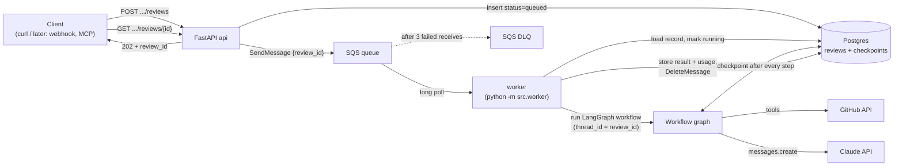
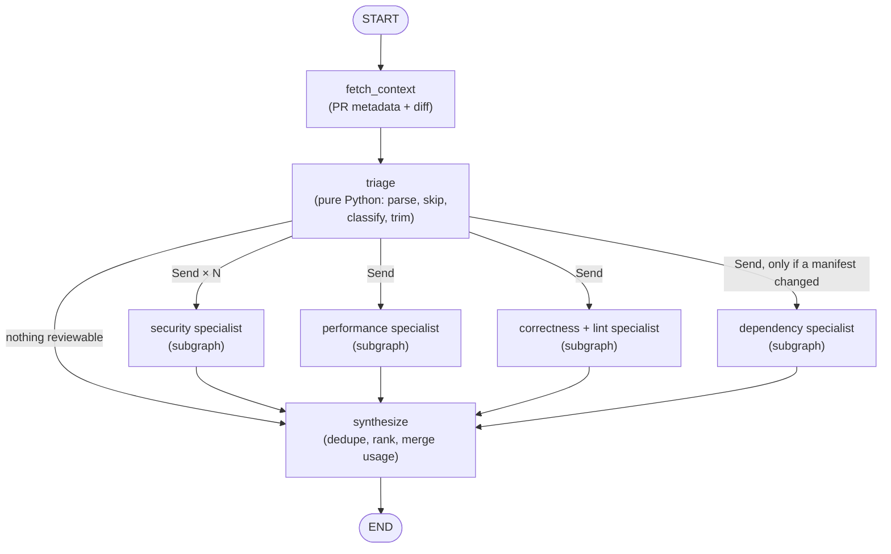

# Week 3 — LangGraph Rebuild, Durable State, and a Real Queue

## What This Week Is

Week 2 built a code review agent by hand: a `for` loop that sends the PR diff to Claude, runs whichever tools Claude asks for, feeds the results back, and repeats until Claude calls `submit_review` (or the loop runs out of budget). It works mechanically, but it has three real limits that Week 2's own retrospective recorded honestly:

1. **It has never actually finished a successful review against a real PR.** The only real run (against the large `raw-agent-loop` PR) exhausted `MAX_ITERATIONS` without submitting. The small test PR (`test/small-readme-pr`) was created specifically to fix that and hasn't been run yet.
2. **It is one big conversation.** Every tool result, from every file, piles into a single ever-growing message history. On a big PR that's slow, expensive, and the reason the model ran out of iterations: one agent trying to review everything at once, one tool call at a time.
3. **It is synchronous.** The HTTP request stays open until the review finishes. A review can take minutes, so any network hiccup, client timeout, or server restart during that time throws the whole review (and the money already spent on it) away.

Week 3 addresses all three, in this order:

- **Close out Week 2 properly** (one successful end-to-end run, plus a fix for the non-convergence problem), so there's a working baseline to compare against.
- **Rebuild the agent with LangGraph, twice.** First as a *faithful port*: the exact same behavior expressed as a graph, so the comparison with Week 2 is apples to apples. Then as a *restructured workflow*: a deterministic triage step, then parallel specialist reviewers (security, performance, correctness, dependencies), each with its own small context and budget, merged by a synthesis step. That second version is the one that actually uses what a graph framework is good at.
- **One specialist rebuilt a third way, with LangChain's `ChatAnthropic` + `ToolNode`,** side by side with the raw-SDK version, so the "LangGraph (orchestration) vs LangChain (model/tool wrappers)" distinction is something you've felt, not just read about.
- **Measure all of it** (success rate, tokens, cost, wall-clock time, lines of code) against the same PRs, and write the comparison down. This is the Month 2 interview story: *"I built the same agent three ways; here's when each one is worth it."*
- **Make reviews durable and asynchronous.** Postgres stores review records *and* LangGraph's checkpoints (so a half-finished review can resume after a crash instead of starting over and paying again). SQS queues review requests, and a separate worker process picks them up. The API answers immediately with a review ID you can poll.

By the end of the week, `POST .../reviews` returns `202 Accepted` with a review ID in milliseconds; a worker pulls the job off SQS, runs the LangGraph workflow with checkpointing, and writes the result to Postgres; and `GET .../reviews/{id}` shows its status and, once done, the findings plus exactly what they cost.

---

## Where Week 2 Left Off (Carry-overs)

| Carry-over | Where it's handled |
|---|---|
| No successful end-to-end review yet | Day 1, first thing, before anything new is built |
| Root cause of non-convergence (Haiku calls one tool per turn, prompt has no budget awareness, no forced final submission) | Day 1: forced `submit_review` on the final iteration + a "batch independent tool calls" instruction. Day 2 then attacks the underlying cause (one agent, one giant context) structurally |
| The review endpoint is synchronous | Day 5 (SQS + worker) |
| `docs/week-2/week-2-day-5.md`, `week-2-retrospective.md`, the two new learning-plan files, and the `architecture-patterns.md` edit are still uncommitted on `raw-agent-loop` | Commit them before starting Day 1, so Week 3's diff starts clean |
| `raw-agent-loop` isn't merged to `main` yet | Merge (or PR) before Day 1 and branch `langgraph-rebuild` from `main`. Week 3 builds on Week 2's code, so it should branch from where that code officially lives |

---

## Technology Check (done 2026-09-30, before writing this plan)

Everything below was confirmed by installing the packages into a throwaway environment and inspecting or running them. None of it comes from memory.

- **LangGraph is at 1.2.12** (released 2026-09-21). Confirmed APIs: `StateGraph(State, context_schema=...)`, `add_node(..., timeout=, retry_policy=, error_handler=)`, `add_conditional_edges`, `Send` for fan-out, `langgraph.runtime.Runtime` for passing non-state dependencies into nodes, `InMemorySaver` for tests, `compile(checkpointer=...)`, and `astream(stream_mode="updates")`. A throwaway graph with fan-out, per-node timeout, reducers, runtime context, and a checkpointer was run end to end, and it behaved as this plan assumes.
- **Correction to the September technology note** (`learning-plan-final-September.md` says the new v3 streaming API "replaced the older event-stream shape"). It hasn't replaced it. `astream_events(version="v3")` exists but is explicitly marked **beta/experimental** in the source (`@beta(message="The v3 streaming protocol on Pregel is experimental.")`), and `astream(...)` still takes `version="v1"|"v2"`. This week uses the stable `astream(stream_mode="updates")` and treats v3 as something to look at, not build on. Recorded here rather than silently edited into the September file, following the project's "note it in the week it changes" rule.
- **`create_react_agent` is deprecated.** It still ships in `langgraph.prebuilt`, but carries a deprecation marker. Not used this week anyway (see Day 1's alternatives), but worth knowing if a tutorial reaches for it.
- **Real gotcha found while checking: Anthropic SDK objects in graph state.** Putting the SDK's `TextBlock`/`ToolUseBlock` objects directly into LangGraph state *works today*, but deserializing them from a checkpoint logs *"Deserializing unregistered type ... This will be blocked in a future version."* Decision (Day 1): graph state holds **only plain JSON-shaped data** (`block.model_dump(exclude_none=True)`), never SDK objects. Getting that right on Day 1 is what makes Day 4's checkpointer work without surprises.
- **`GenericFakeChatModel` (LangChain's built-in fake chat model) doesn't support `bind_tools`.** It raises `NotImplementedError`. Day 3's tests need a small subclass. Found now instead of on Day 3.
- **LocalStack needs an account now.** Since 2026-03-23, the `localstack/localstack` image requires `LOCALSTACK_AUTH_TOKEN`. The free **Hobby** plan (non-commercial use, which this project is) covers the old Community features, SQS included. That's a new manual step for Day 5 (see below). Fallback if that becomes a problem: **ElasticMQ**, an open-source SQS-compatible server that needs no account.
- **`aioboto3`'s last release was 2025-10-30**, while `aiobotocore` (the library it wraps) shipped 3.9.1 on 2026-09-07. Day 5 uses `aiobotocore` directly (see Decisions).
- **Postgres checkpointer**: `langgraph-checkpoint-postgres` 3.1.2, built on **psycopg 3** (3.3.6). Its constructor accepts either one `AsyncConnection` or an `AsyncConnectionPool`, so the app's review records and the checkpointer can share one pool.
- Other current versions: `langchain-anthropic` 1.7.5, `langchain-core` 1.6.6, `boto3` 1.43.x.

---

## The Concepts This Week, Explained Simply

Each concept gets a "like I'm five" explanation, then the real one. The day plans go much deeper; this is the map.

### A graph (as in LangGraph)
**Like I'm five:** a board game. Squares are things you do ("read the PR", "check for security problems"). Arrows show where you can go next. Some squares have a fork ("if you rolled a six, go left"). You move your piece along until you reach FINISH.

**Really:** a *state machine* where each **node** is a function and each **edge** says which node runs next. Week 2's loop *is* a graph already (call model → run tools → call model → ... → done), just written as a `for` loop with `if`s. LangGraph makes that shape explicit: you declare the nodes and edges, and the framework runs them. What you get for that explicitness: things a `for` loop makes awkward, such as running branches in parallel, saving progress between steps, pausing for a human, drawing the flow as a diagram, and streaming "which step am I on."

### State and reducers
**Like I'm five:** there's one shared notebook every player writes in. The rule for most pages is "cross out the old answer, write the new one." But some pages say "never erase, only add to the bottom," like a shopping list where everyone adds items.

**Really:** LangGraph **state** is a typed dict passed between nodes. A node returns only the keys it wants to change. A **reducer** decides how a returned value merges into the existing one. The default is "replace"; `Annotated[list, operator.add]` means "append", and `Annotated[int, operator.add]` means "sum". Reducers are what let four specialists running *at the same time* all add findings and token counts without overwriting each other. (Verified: two parallel `Send` branches each returning `tokens: 5` produced `tokens: 10`.)

### Conditional edges
**Like I'm five:** a fork in the path with a signpost. The signpost looks at your notebook and says "go left" or "go right."

**Really:** a plain Python function that reads the state and returns the *name* of the next node (or several names). It holds the routing logic that lived in Week 2's `if response.stop_reason != "tool_use"` branches, now in one visible place.

### Fan-out with `Send` (map-reduce)
**Like I'm five:** the teacher hands one worksheet to each of four kids at once, and when everyone's done, the answers go in one pile.

**Really:** a conditional edge can return a list of `Send("node_name", its_own_input)` objects. LangGraph then runs that node once per `Send`, in parallel, each with its own input, and merges their outputs back into shared state through the reducers. This is how Day 2 runs security, performance, correctness, and dependency specialists concurrently.

### Subgraphs
**Like I'm five:** one square on the big board is actually a little board game of its own. You play the mini-game, and only your final score comes back to the big board.

**Really:** a compiled graph used as a node inside another graph. Each Day 2 specialist is a small tool-calling loop (Day 1's port, reused and parametrized) running as a subgraph. Its long message history stays *inside* the subgraph, and only its findings and token counts flow back up. That's the "context management" this week's plan calls for.

### Runtime context (vs state)
**Like I'm five:** the notebook is shared and gets photocopied and saved. Your house key is not something you write in the notebook. You keep it in your pocket.

**Really:** `StateGraph(State, context_schema=ReviewContext)` plus `runtime: Runtime[ReviewContext]` in each node lets a node reach the `httpx` client, Anthropic client, installation token, and owner/repo **without** those being in state. This matters because state is exactly what gets written to Postgres by the checkpointer. (Verified: a value passed via `context=` did not appear in the saved checkpoint.) It's the same instinct as Week 2's executors closing over credentials the model must never see, applied to "what gets persisted" instead of "what the model sees."

### Checkpointer and threads
**Like I'm five:** a bookmark. If you fall asleep halfway through the book, tomorrow you open it at the bookmark instead of starting again from page one.

**Really:** after every step, LangGraph writes the current state to a **checkpointer** (in-memory for tests, Postgres for real), keyed by a **thread ID**. Invoke the graph again with the same thread ID and it continues from the last saved step. With fan-out, results from specialists that *already finished* are saved too, so only the unfinished ones re-run. For this project, that means a review interrupted by a worker crash doesn't re-pay for the specialists that already completed.

### LangChain vs LangGraph
**Like I'm five:** LangGraph is the *rules of the board game*. LangChain is a box of *universal game pieces* that fit many different games. You can play LangGraph with your own homemade pieces (the raw Anthropic SDK) or with LangChain's.

**Really:** LangGraph is the orchestration layer (graphs, state, checkpoints). LangChain (`langchain-core` + `langchain-anthropic`) is a provider-neutral wrapper around model calls and tools: `ChatAnthropic`, `bind_tools`, the `@tool` decorator, `ToolNode`. They're often taught together, but they're independent. Most of this week uses LangGraph with the raw SDK. Day 3 builds one specialist with LangChain's pieces so the difference is concrete.

### Message queue (SQS)
**Like I'm five:** a ticket rail in a restaurant kitchen. The waiter clips an order ticket to the rail and goes back to the customers straight away. A cook takes the next ticket when they're free. Nobody stands at the counter waiting.

**Really:** the API (the **producer**) puts a small message on a queue and returns immediately. A separate **worker** process (the **consumer**) pulls messages off and does the slow work. The queue absorbs bursts (ten PRs opened at once), survives the API restarting, and lets you scale workers separately from the API.

### Visibility timeout, at-least-once delivery, idempotency
**Like I'm five:** when a cook takes a ticket, it goes invisible for 15 minutes. If the cook finishes, they throw the ticket away. If the cook faints, the ticket reappears on the rail and another cook picks it up. Sometimes a ticket reappears even though the first cook *did* finish, so a smart cook checks "was this order already served?" before cooking it again.

**Really:** SQS doesn't delete a message when it's received. It hides it for the **visibility timeout**, and the worker must explicitly delete it after success. If the worker crashes, the message reappears and is retried. This makes delivery **at-least-once**: occasionally the same message arrives twice. The worker must therefore be **idempotent**, meaning processing the same message twice has the same effect as once. Here that means checking the review's status in Postgres first, and resuming from the checkpoint instead of restarting.

### Dead-letter queue (DLQ)
**Like I'm five:** if a ticket has made three cooks faint, it goes into a special box so it stops hurting cooks, and a grown-up looks at it later.

**Really:** a second queue. A **redrive policy** (`maxReceiveCount: 3`) moves a message there automatically after it's been received three times without being deleted. That stops a "poison message" from crashing workers forever and keeps it around for inspection.

### 202 Accepted + polling
**Like I'm five:** a restaurant buzzer. You order, they hand you a buzzer, and you check it (or it buzzes) when your food's ready.

**Really:** `202 Accepted` means "I've taken your request, it isn't done yet." The response carries a review ID and a URL (`Location` header) to poll. Webhooks (Week 4) are the "it buzzes" version.

### Connection pool, migrations, JSONB
**Like I'm five:** a pool is a set of phones already connected to the database, shared so nobody has to dial from scratch each time. A migration is a numbered instruction card for building the database's shelves, done in order, never skipped, never done twice. JSONB is a shelf where you can drop a whole labelled box without first deciding its exact compartments.

**Really:** `psycopg_pool.AsyncConnectionPool` reuses open connections, the same idea as Week 1's shared `httpx.AsyncClient`. Numbered `.sql` migrations are applied once each and recorded in a `schema_migrations` table. `JSONB` columns store the findings list and usage object as structured, queryable JSON without a table per nested shape.

---

## Decisions Made Up Front

Each one lists what was chosen, what else was considered, and why.

### 1. Two LangGraph graphs, not one: a faithful port (Day 1), then a restructured workflow (Day 2)
- **Chosen:** Day 1 translates Week 2's loop 1:1 into a graph: same tools, same prompt, same budget, same outputs, and the same test scenarios pass against both. Day 2 then builds the graph the learning plan describes (triage → parallel specialists → synthesis).
- **Alternative:** go straight to the specialist workflow.
- **Why not:** it would change two things at once (framework *and* architecture), so the comparison couldn't say which change caused which difference. A "LangGraph is better" conclusion drawn from a restructured graph might really be "specialists are better", which is equally achievable with plain `asyncio.gather` in hand-rolled code. The port isolates the framework. The workflow isolates the architecture.

### 2. LangGraph nodes call the raw Anthropic SDK; one specialist is additionally built with LangChain's `ChatAnthropic` + `ToolNode` (your choice: "both, side by side")
- **Chosen:** every node uses the same `anthropic.AsyncAnthropic` client, tool definitions, executors, and cost tracking as Week 2. On Day 3, the *security* specialist also gets a LangChain implementation, selectable by engine name, so you can compare the two.
- **Alternatives:** (a) LangChain everywhere, the "tutorial default" stack; (b) raw SDK only.
- **Why:** (a) would blur "LangGraph vs hand-rolled" with "LangChain wrapper vs raw SDK" and throw away Week 2's test fakes and hand-narrowed tool schemas. (b) would skip experiencing the LangChain layer that job descriptions (Polygon's especially) name explicitly. One specialist is enough to feel the difference (schema-from-docstring vs hand-written schema, `InjectedState`/`ToolRuntime` vs executor closures, `usage_metadata` vs `response.usage`) without doubling the week's work.

### 3. Graph state holds only plain JSON-shaped data; dependencies and credentials go through runtime `context`
- **Chosen:** message content blocks are stored as `dict`s, findings as validated-then-dumped dicts, and usage as integers. The HTTP client, Anthropic client, installation token, owner/repo, and head SHA are passed via `context=ReviewContext(...)`.
- **Alternative:** put everything in state (simplest to write), or keep SDK objects in state.
- **Why:** state is exactly what the Day 4 checkpointer writes to Postgres. An installation token in state means a live credential at rest in a database table. SDK objects in state trigger a verified future-breaking deserialization warning. Plain data plus context avoids both, from the start.

### 4. Postgres for review records *and* LangGraph checkpoints, via psycopg 3 and one shared pool (your choice)
- **Chosen:** a `postgres:17` container, a `reviews` table, `AsyncPostgresSaver` for checkpoints, and one `psycopg_pool.AsyncConnectionPool` opened in FastAPI's lifespan (and in the worker's startup).
- **Alternatives:** Redis (status/result blobs with a TTL), MongoDB (document history), or SQLite checkpoints plus some other record store.
- **Why:** one store serves both needs; the checkpointer is Postgres- (or SQLite-) native, not Redis/Mongo in the official packages; Month 1's doctriage already runs Postgres (pgvector), so this is the same operational skill on the VPS; and SQL fits the queries Week 4 needs (`list_recent_reviews(repo)`, status counts). The cost is more new surface this week (migrations, pooling, checkpoint semantics), accepted deliberately.
- **Driver:** psycopg 3, because the checkpointer already requires it. Adding `asyncpg` for the app's own queries would mean two Postgres drivers and two pools in one process. SQLAlchemy's async ORM was considered and rejected as a lot of machinery for one table.

### 5. SQS Standard queue + DLQ; LocalStack for development, real AWS verified once (your choice)
- **Chosen:** a Standard queue (not FIFO) with a redrive policy to a DLQ after 3 receives, a 15-minute visibility timeout, and 20-second long polling. Development and tests run against LocalStack in docker-compose; one real end-to-end run against actual AWS SQS at the end of Day 5.
- **Alternatives considered:**
  - *FIFO queue:* exactly-once *processing within a 5-minute dedup window* and ordering. Ordering doesn't matter for independent reviews, and the dedup window is too short to replace app-level idempotency anyway, which is needed regardless.
  - *FastAPI `BackgroundTasks`:* no durability. A restart silently loses in-flight reviews, and there's no retry and no DLQ.
  - *Redis-based queues (`arq`, RQ, Celery+Redis):* would work, but the learning plan specifically targets a managed AWS queue, the interview story is "I know when to reach for a managed queue", and Celery is a large framework to learn for one queue.
  - *Kafka:* Month 3's lesson. An event log is overkill for a work queue.
  - *Real AWS throughout:* needs credentials from day one and every dev run touches AWS. LocalStack keeps tests offline and credential-free.

### 6. A separate worker process, same Docker image, different command
- **Chosen:** `python -m src.worker` as its own compose service (`worker`), built from the same image as `api`.
- **Alternative:** run the SQS polling loop as a background task inside the FastAPI process.
- **Why:** the whole point is that API restarts/deploys don't kill in-flight reviews, and that review throughput scales independently from HTTP throughput. An in-process consumer would couple the two again. The same image keeps one build and one dependency set, and the difference is only the entrypoint.

### 7. `aiobotocore` for async SQS calls
- **Chosen:** `aiobotocore`, maintained and current, native `async`.
- **Alternatives:** `aioboto3` (friendlier "resource" API, but its last release is ~11 months old and it pins `aiobotocore` versions); plain `boto3` via `asyncio.to_thread` (simple and well documented; a thread per blocking call is honestly fine for a long-poll worker).
- **Why:** this project has been "async throughout" since Week 1 (Week 2 used `create_subprocess_exec` rather than `subprocess.run` for the same reason), and `aiobotocore` gets that without depending on a lagging wrapper. `boto3` + `to_thread` stays documented as the fallback if `aiobotocore`'s lower-level API turns out to be painful.

### 8. The message body is just `{"review_id": ...}` (claim check)
- **Like I'm five:** the ticket on the rail just says "order #42". The actual order is written in the book at the counter.
- **Why:** everything else (owner, repo, PR number, head SHA, installation ID, engine) lives in the Postgres row. The message can't drift out of sync with the record, holds nothing sensitive, and stays tiny. SQS messages are visible to anyone with queue access, so they should hold no secrets and ideally no code.

### 9. All engines stay selectable this week; nothing gets deleted yet
- **Chosen:** `engine: Literal["loop", "graph", "workflow", "workflow_lc"]`, defaulting to `"loop"` until the Day 3 measurements justify switching the default to `"workflow"`.
- **Why:** normally this project deletes superseded code rather than keeping it around (see the OAuth → GitHub App migration in `architecture-patterns.md`). Here keeping both is temporarily the point, because the comparison is a deliverable. The retrospective records which engine survives into Week 4 (the MCP server wraps exactly one), and the others get deleted then, not left to rot.

---

## Target Architecture at End of Week



And the workflow graph itself (Day 2):



---

## Manual Steps Required This Week

- **Before Day 1:** commit the uncommitted Week 2 docs, and merge/PR `raw-agent-loop` into `main`.
- **Before Day 4:** Docker Desktop running (Postgres runs in compose). Nothing to register.
- **Before Day 5:**
  1. **LocalStack account.** Create a free account at `app.localstack.cloud` (Hobby plan), generate an auth token (Settings → Auth Tokens), and put `LOCALSTACK_AUTH_TOKEN=...` in `.env`. This is new since March 2026. If you'd rather not create an account, say so on Day 5 and the compose file uses ElasticMQ instead. The app code doesn't change either way, since both speak the SQS API.
  2. **AWS account + an IAM user** with a least-privilege policy for just the two queues (the exact policy JSON is in the Day 5 plan), plus its access key in `.env` for the one real-AWS verification run. Region: `ap-south-1` (Mumbai), the nearest to you. SQS's free tier (1M requests/month) covers this week many times over.

---

## Day-by-Day Plan (summary; each day has its own detailed plan doc)

### Day 1 — Close Week 2, extract shared tools, faithful LangGraph port → `week-3-day-1-plan.md`
- One real successful review against `test/small-readme-pr` with the Week 2 loop, before anything new is built.
- Fix non-convergence at the loop level: force `tool_choice` to `submit_review` on the last iteration, and tell the model to batch independent tool calls.
- Move tool definitions and executors from `review_agent.py` into `review_tools.py` (a pure move, no behavior change, all 61 tests still green) so both engines share one copy.
- LangGraph fundamentals, then `src/services/review_graph/loop_graph.py`: the same loop as a `StateGraph` (`call_model` → route → `run_tools` → back, with forced-final and fail exits).
- `?engine=loop|graph` on the existing endpoint. Week 2's agent tests are parametrized to run against **both** engines with the same fake client, which is the proof that the port is faithful.

### Day 2 — The workflow: triage, parallel specialists, synthesis → `week-3-day-2-plan.md`
- `triage.py`: a no-LLM pass that parses the unified diff into per-file entries, skips lockfiles/generated/vendored/binary/deleted files, classifies by language, and trims oversized hunks. This is the "large-diff preprocessing" idea from Week 1's forward-looking notes, finally built because there's now a concrete need.
- Specialists as parametrized subgraphs (the Day 1 loop graph reused): each has its own system prompt, tool subset, file subset, and iteration budget. They fan out via `Send`, and the dependency specialist runs only when a manifest changed.
- `synthesize`: deterministic dedupe/rank/merge, with usage summed through reducers.
- Partial results: a specialist failure produces a review marked `incomplete` with the failed specialist named, not a failed review.
- Per-node `timeout=` on specialists. Retry stays in the Anthropic SDK (a node-level retry would re-run and re-pay for a whole specialist).
- `engine=workflow`. The fake client is upgraded to route scripted responses *by specialist* rather than by call order, because parallel calls arrive in nondeterministic order.

### Day 3 — LangChain side by side, streaming, and measuring everything → `week-3-day-3-plan.md`
- The security specialist rebuilt with `ChatAnthropic.bind_tools` + `@tool` + `ToolRuntime` + `ToolNode` + `tools_condition` (`engine=workflow_lc`), plus a small `bind_tools`-capable fake chat model for tests.
- `astream(stream_mode="updates")` gives node-level progress logging for the graph engines.
- `scripts/compare_engines.py` runs every engine against three PRs (small, medium, large), twice each, and records success, findings, LLM calls, tokens, cost, and wall-clock time into `docs/week-3/engine-comparison.md`, together with lines of code and a qualitative "how hard was X to change/debug."
- Decide the default engine going forward, based on data.

### Day 4 — Postgres: review records and checkpoints → `week-3-day-4-plan.md`
- `postgres:17` in compose; `DATABASE_URL` added to `Settings`; one psycopg pool in lifespan.
- Numbered SQL migrations with a tiny runner (`schema_migrations` table plus a Postgres advisory lock so `api` and `worker` starting together can't both migrate).
- `reviews` table and a small repository module. A partial unique index prevents duplicate active reviews of the same PR head.
- `AsyncPostgresSaver` wired into the graph engines with `thread_id = review_id`. A crash-and-resume test proves completed specialists aren't re-run. Checkpoints are deleted once a review reaches a terminal state.
- `GET /github-app/reviews/{review_id}`, scoped to the caller's installation (another installation's review returns `404`, not `403`, so its existence isn't revealed).

### Day 5 — SQS, the worker, and going asynchronous → `week-3-day-5-plan.md`
- LocalStack in compose with an init script that creates the queue and DLQ and sets the redrive policy.
- `POST .../reviews` → validate the PR, insert `queued`, `SendMessage`, return `202` + `Location`.
- `src/worker.py`: long-poll loop, bounded concurrency, idempotent `handle_message`, checkpoint resume on redelivery, a clear split between deterministic failures (mark failed, delete the message) and transient ones (leave the message for redelivery/DLQ), and graceful shutdown on SIGTERM.
- One real-AWS end-to-end run.
- Week 3 docs: day retro, engine comparison conclusions, `architecture-patterns.md` Week 3 section, week retrospective.

---

## New and Changed Files (end of week)

```
src/
  config/settings.py                  # + database_url (Day 4), sqs_queue_url / aws_region / aws_endpoint_url (Day 5)
  main.py                             # lifespan: + db pool, migrations, checkpointer, SQS client
  worker.py                           # NEW (Day 5) — SQS consumer entrypoint
  db/                                 # NEW (Day 4)
    pool.py
    migrate.py
    migrations/001_reviews.sql
    reviews_repository.py
  queue/                              # NEW (Day 5)
    sqs.py
  routers/
    review.py                         # + ?engine= (Day 1), persists a record (Day 4)
    reviews.py                        # NEW — POST .../reviews (202), GET .../reviews/{id}
  schemas/review.py                   # + Engine, ReviewStatus, ReviewRecord, incomplete_specialists
  services/
    review_agent.py                   # Week 2 loop — tools moved out; forced-final submit added
    review_tools.py                   # NEW (Day 1) — shared tool definitions + executors
    review_engines.py                 # NEW (Day 1) — engine name → runner function
    review_graph/                     # NEW
      state.py                        # state TypedDicts + ReviewContext
      loop_graph.py                   # Day 1 — faithful port
      triage.py                       # Day 2 — no-LLM diff inventory
      specialists.py                  # Day 2 — specialist configs + subgraph factory
      workflow_graph.py               # Day 2 — triage → Send → specialists → synthesize
      synthesize.py                   # Day 2
      lc_specialist.py                # Day 3 — ChatAnthropic/ToolNode security specialist
scripts/compare_engines.py            # NEW (Day 3)
localstack/init/ready.d/create-queues.sh   # NEW (Day 5)
docker-compose.yml                    # + postgres, localstack, worker
tests/                                # + test_loop_graph, test_triage, test_workflow_graph,
                                      #   test_lc_specialist, test_reviews_repository (integration),
                                      #   test_worker, test_reviews_router
docs/week-3/                          # this plan, day plans, day retros, engine-comparison.md, retrospective
```

New runtime dependencies (each added on the day it's first used, following the Settings "only when consumed" discipline): `langgraph` (Day 1); `langchain-anthropic` (Day 3); `langgraph-checkpoint-postgres`, `psycopg[binary,pool]` (Day 4); `aiobotocore` (Day 5).

---

## Scope Risk, Stated Honestly

This is a heavier week than Week 2: three engines, two new pieces of infrastructure (Postgres, SQS), and a worker process. At 10–15 hours it's doable only if cuts are decided **now**, not mid-week. In order:

1. **First cut:** Day 3's LangChain specialist shrinks to "built and unit-tested, not measured" (skip it in the comparison runs).
2. **Second cut:** the real-AWS verification slips to Week 4's VPS deploy (LocalStack-only this week).
3. **Third cut:** prompt caching (a Day 2 stretch goal) and the `durability` mode experiments (Day 4) are dropped entirely.

What must **not** be cut: the Day 1 parity tests (they're what makes the comparison honest), the Day 3 measurements (they're the week's interview story), and idempotency on Day 5 (without it the queue produces duplicate paid reviews).

---

## .NET Parallels

- A LangGraph `StateGraph` ≈ **Azure Durable Functions orchestrations** or **Workflow Foundation**: a declared flow whose progress is persisted between steps. The checkpointer ≈ Durable Functions' history table, which is why an orchestrator can "replay" to where it left off after a host restart.
- `Send` fan-out + reducers ≈ Durable Functions' fan-out/fan-in (`Task.WhenAll` over activity calls), or TPL Dataflow's `BroadcastBlock` → `JoinBlock`.
- The SQS worker ≈ an `IHostedService`/`BackgroundService` running a receive loop. `DeleteMessage`-after-success ≈ Azure Service Bus's `PeekLock` + `CompleteAsync`, visibility timeout ≈ the lock duration, and the DLQ is literally the same concept (Service Bus's `$DeadLetterQueue` with `MaxDeliveryCount`).
- Numbered SQL migrations with a journal table ≈ **DbUp** (exactly this pattern) rather than EF Core migrations (closer to Alembic).
- `psycopg_pool` ≈ Npgsql's built-in connection pooling, except in .NET it's implicit per connection string and here it's an explicit object you own.
- `202 Accepted` + `Location` + polling ≈ the Azure "async request-reply" pattern (the same one Durable Functions' HTTP starter returns).

---

## Automated Verification

- Week 2's agent-loop scenarios pass against **both** `loop` and `graph` engines (parametrized, same fake client).
- Triage is covered by table-driven unit tests on fixture diffs (skip rules, language classification, trimming, manifest detection).
- Routing is tested directly: for a given triage result, exactly the expected `Send`s are produced (for example, no dependency specialist without a manifest change, no specialists at all for a docs-only PR).
- The workflow graph is tested end to end with a specialist-aware fake client, including one specialist failing → `incomplete` result, not a failed review.
- The LangChain specialist is tested with a `bind_tools`-capable fake chat model.
- Repository and migrations run as **integration tests** against the compose Postgres (a pytest marker, skipped automatically when `DATABASE_URL` isn't set, so `uv run pytest` still works offline).
- Crash-resume: a graph interrupted mid-run resumes from its checkpoint without re-invoking completed specialists (asserted via the fake client's call log).
- The worker's `handle_message` is unit-tested for queued → succeeded, a duplicate delivery of an already-succeeded review (no re-run, message deleted), a deterministic failure (marked failed, message deleted), and a transient failure (message *not* deleted).
- SQS adapter integration tests run against LocalStack (marker, skipped when the endpoint isn't configured).
- `uv run pytest` and `uv run ruff check .` are clean.

## Manual Verification

```bash
docker compose up --build            # api, worker, postgres, localstack

# Async flow
curl -i -X POST -b cookies.txt \
  "http://localhost:8000/github-app/repos/<owner>/<repo>/pulls/<n>/reviews?engine=workflow"
# → 202, Location: /github-app/reviews/<id>

curl -b cookies.txt http://localhost:8000/github-app/reviews/<id>
# → queued → running → succeeded, with findings + usage

# Resilience
docker compose kill worker   # mid-review
docker compose up -d worker  # message reappears after the visibility timeout;
                             # logs show the graph RESUMING, not restarting

# Duplicate POST for the same PR head while one is active → same review_id back
```

---

## End-of-Week Checklist

- [ ] Week 2 closed: one real successful review on `test/small-readme-pr`, with cost reported
- [ ] `review_tools.py` extracted; all pre-existing tests still green
- [ ] Faithful port: Week 2's scenarios pass against both `loop` and `graph`
- [ ] Workflow: triage + parallel specialists + synthesis produce a real review on a multi-file PR the Week 2 loop couldn't finish
- [ ] A specialist failure yields an `incomplete` review, not a `502`
- [ ] LangChain security specialist built and tested (`workflow_lc`)
- [ ] `docs/week-3/engine-comparison.md` exists with real measured numbers and a stated default-engine decision
- [ ] Postgres: migrations apply once, the repository works, and checkpoints resume after a simulated crash
- [ ] `POST .../reviews` returns `202`; the worker completes the review; `GET` shows the result
- [ ] Duplicate deliveries and duplicate POSTs don't produce duplicate paid reviews
- [ ] A poison message lands in the DLQ after 3 receives
- [ ] One real-AWS SQS end-to-end run completed (or explicitly cut per the scope order above)
- [ ] `uv run pytest` and `uv run ruff check .` both pass
- [ ] Week 3 retro docs + `architecture-patterns.md` Week 3 section written

---

## Learning Notes: Similarities to Prior Work

Private cross-reference only — doesn't affect anything above.

- **Port first, restructure second** is the same discipline as Week 2's "hand-rolled before framework": change one variable at a time so the comparison means something. Week 2 isolated "loop mechanics" from "framework". This week isolates "framework" from "architecture."
- **Credentials in runtime context, never in persisted state** is Week 1's "signed opaque identifier, never the secret, in the cookie" and Week 2's "executors close over the token the model never sees", applied a third time to a third boundary (what gets written to disk).
- **The claim-check message body** (`{"review_id"}` only) repeats the cookie design again: the thing that travels carries a handle, and the real data stays server-side.
- **Idempotent consumers + DLQ + bounded receives** are `github_retry.py`'s "bounded retry, then give up loudly" moved to infrastructure: SQS enforces the attempt cap, and the DLQ is the loud part.
- **The doctriage cross-over:** Month 1 also runs Postgres. The migration runner and pool pattern built here are the same skills. If this project's schema and doctriage's ever share the VPS's Postgres instance, they get separate databases, not shared tables.
- **Found-before-building gotchas** (SDK objects in checkpoints, `GenericFakeChatModel` lacking `bind_tools`, LocalStack's auth change, the "v3 replaced streaming" claim being overstated) are the Week 2 lesson ("only a real run catches this") applied *proactively*: this time the throwaway environment was run before the plan was written, not after the code failed.
